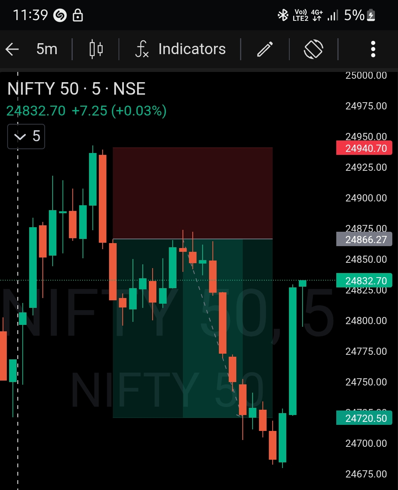

# Post-Market Review — 02 Feb 2026

## NIFTY50 | Opening Control Framework

### Pre-Plan Zone (Bear Bias): 24600 – 24980

- Market opened **inside the predefined sell zone** → bearish edge validated  
- No directional guessing → **sell-side framework activated**  
- Opening structure aligned with higher timeframe bearish bias  

---

## Execution Logic

- **Timeframe:** 5-minute  
- **Key Trigger:** 9:55 AM candle  
- **Observation:** Large bearish expansion candle → momentum confirmation  
- **Entry:** 10:00 AM (Sell) as per system rules  
- **Risk Management:**  
  - Fixed Stop-Loss  
  - **Risk:Reward = 1:2**  
- Post-entry → trade left untouched (no micromanagement)

---

## Execution Outcome

- Price followed bearish continuation structure  
- **Target hit at 11:10 AM**  
- Clean execution with zero emotional intervention  
- Trade respected predefined RR and time logic

---

## Post-Session Observations

- Opening zone validation **filters low-quality trades**  
- Waiting for a **structure candle (9:55)** improves execution quality  
- Fixed RR enables **hands-free execution**  
- Time-based patience is as critical as price confirmation

---

## Key Takeaways

- **Framework first:** Trade only when opening zone validates bias  
- **Execution discipline:** Entry only after structure confirmation  
- **Risk control:** Predefined SL & RR reduce decision fatigue  
- **Process > Outcome:** Consistent rule-following compounds edge

---

## Chart / Image

---

## Video Reference

<video width="600" controls>
  <source src="./2026-02-02-nifty50-post.mp4" type="video/mp4">
  Your browser does not support the video tag.
</video>

---

## Disclaimer

This post is **not shared in real time**.  

As per **SEBI guidelines**, live market data or real-time trade updates are **not posted**.  

Observations are shared with a **time delay during market hours**, strictly for **educational and journal documentation purposes**.
