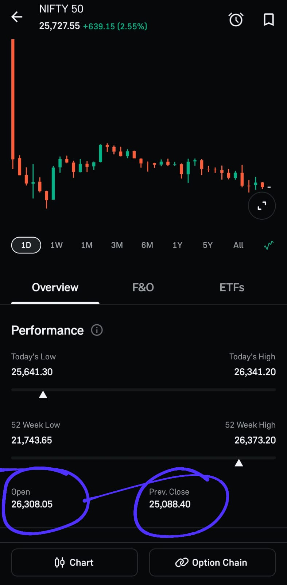

# Post-Market Review — 03 Feb 2026

## NIFTY50 | Opening Control Framework

### Pre-Plan Condition (Bear Bias): 25000 – 25240

- Bearish execution was **strictly conditional**
- Sell-side trades were valid **only if market opened inside 25000–25240**
- Any opening **above 25240 = plan invalidated**

---

## Market Open Observation

- Market opened **above 25240**
- Primary bearish condition **failed at open**
- Opening structure **did not support sell-side bias**
- As per framework → **bearish plan stood INVALIDATED**

---

## Execution Decision

- **Trade Action:** No Trade  
- **Reason:**  
  - Opening level breached critical invalidation zone  
  - No structural alignment with pre-defined bearish framework  
- No counter-bias trades taken  
- No reactive entries attempted

---

## Why No Trade Is a Valid Trade

- Framework protects capital when **conditions are not met**
- Avoiding forced trades preserves:
  - Mental capital  
  - Risk capital  
  - System integrity  
- Discipline is proven **more in inaction than in action**

---

## Post-Session Observations

- Opening level is the **highest authority** in this framework  
- Bias is **conditional, not emotional**
- Plan invalidation ≠ failure  
- Plan invalidation = **successful rule-following**

---

## Key Takeaways

- **Levels > Opinions:** Market decides, not bias  
- **Invalidation is information:** It keeps you out of low-probability trades  
- **No trade is execution:** Discipline compounds silently  
- **Process > Ego:** Bias was dropped instantly when context changed

---

## Chart / Image

---

## Disclaimer

This post is **not shared in real time**.

As per **SEBI guidelines**, live market data or real-time trade updates are **not posted**.

Observations are shared with a **time delay during market hours**, strictly for **educational and journal documentation purposes**.
