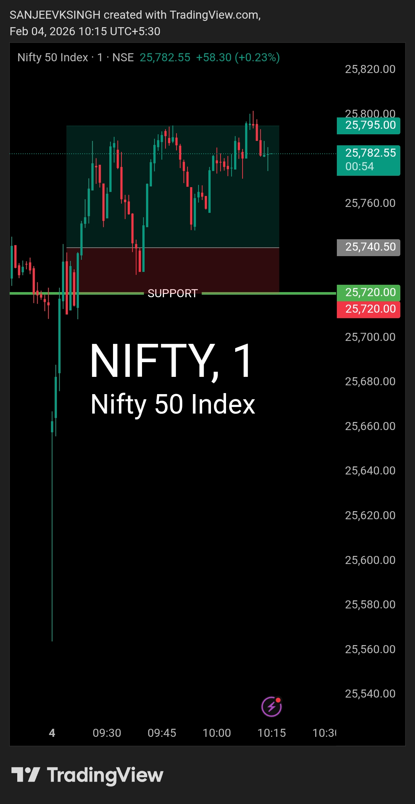

# Post Plan — 4 Feb 2026

| **Market** | NIFTY50 |
|------------|---------|
| **Framework** | Opening Control Framework |
| **Opening Zone** | 25720 – 25860 |
| **Bias** | Bullish |
| **Trade Direction** | Buy side only |

---

## Market Open Analysis

**Opening Behavior:**
- Market opened **below the zone** (below 25720)
- Failed to sustain below for even **3 minutes**
- Buyers aggressively pulled price back into the preplan zone

**Immediate Read:**
This confirmed **seller weakness** and validated bullish control.

---

## Confirmation Wait

Instead of rushing, waited for:
- Price to respect the **pre-decided support at 25720**
- Sustained acceptance inside the zone
- Clear rejection of lower levels

**Confirmation received** — Market held above support with conviction.

---

## Trade Execution

| **Parameter** | **Details** |
|---------------|-------------|
| **Entry Time** | 9:23 AM |
| **Entry Logic** | Zone acceptance + seller rejection |
| **Risk:Reward** | 1:4 |
| **Stop Loss** | Below support zone |
| **Target** | Pre-calculated R:R based target |
| **Target Hit Time** | 10:00 AM |

---

## Key Observations

✅ **Levels held** — Pre-plan zone acted as strong support  
✅ **No panic** — Waited for confirmation instead of reacting to open  
✅ **Seller weakness** — Quick rejection below zone showed lack of selling pressure  
✅ **Buyer conviction** — Sustained move back into zone validated bullish bias  
✅ **Clean execution** — Entry, SL, Target all executed as per plan  

---

## What Worked

1. **Pre-decided framework** — No guesswork, only reaction to price behavior
2. **Patience** — Waited for confirmation instead of chasing the open
3. **Risk management** — 1:4 R:R gave room for price to breathe
4. **Discipline** — Stuck to buy-side only, ignored counter-trend temptation

---

## Core Takeaway

**Levels decide. Bias follows levels. Everything else is noise.**

When price respects your framework, trust it.  
When it confirms your bias, execute with discipline.  
When it gives you the edge, let it run.

---

## Chart / Image

---

## Video Reference

<video width="600" controls>  
  <source src="./2026-02-04-nifty50-post.mp4" type="video/mp4">  
  Your browser does not support the video tag.  
</video>

---

## Disclaimer

This post is not shared in real time.  
As per SEBI guidelines, live market data or real-time trade updates are not posted.  
Observations are shared with a time delay during market hours, strictly for educational and journal documentation purposes.
