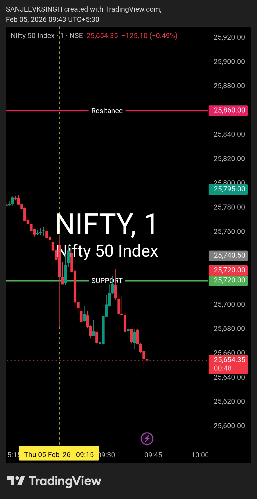

# Post-Market Summary — 5 Feb 2026

---

## The Plan

**Opening Zone:** 25720 – 25860  
**Bias:** Bullish - Buy side only  
**Rule:** If market opens inside the zone, wait for acceptance. Price needs to sustain and show bullish structure before taking any trade.

---

## What Actually Happened

**Opening:** 25755.90 (right inside the zone)  
**The Drop:** Within 30 seconds, price crashed to 25685.25  
**Close:** 25723.50  

Market opened exactly where I wanted it to, but then completely rejected the zone. 70-point drop in half a minute. Support at 25720 broke almost immediately. No acceptance, no bullish structure, nothing.

---

## Why I Didn't Trade

Look, the opening looked perfect - 25755.90 right in my zone. But here's the thing: opening location means nothing without acceptance.

Within 30 seconds, I watched price drop 70 points and break below my support at 25720. That's not acceptance, that's rejection. The market was telling me loud and clear: "This setup is dead."

So I stayed out. Simple as that.

The plan said wait for acceptance. There was no acceptance. No trade.

---

## The Result

- **Trades taken:** 0
- **P&L:** ₹0
- **Capital preserved:** 100%
- **Money saved:** ₹2,625 - ₹5,250 per lot (by not entering a losing trade)

Most traders saw that 25755.90 opening and jumped in immediately. They got stopped out within minutes. I waited, recognized the fake setup, and stayed out.

---

## Bottom Line

Market opened in my zone but refused to accept it. That 70-point drop in 30 seconds was all I needed to see. Framework invalidated, stayed out, protected capital.

No FOMO. No forcing trades. Just following the plan.

---

## Chart

**Opening looked right. Price action proved it wrong. Discipline kept me safe.**

---

## Disclaimer

This post is not shared in real time. As per SEBI guidelines, live market data or real-time trade updates are not posted. Observations are shared with a time delay during market hours, strictly for educational and journal documentation purposes.
