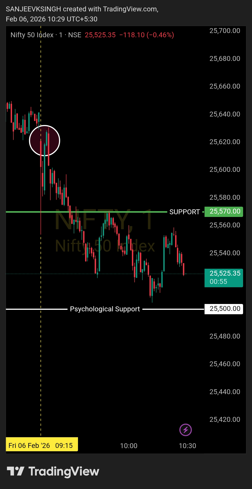

# Post-Market Summary — 6 Feb 2026

---

## The Plan

**Opening Zone:** 25570 – 25740  
**Bias:** Bearish - Sell side only  
**Rule:** If market opens inside the zone, wait for confirmation. Price needs to sustain below resistance and show bearish structure before taking any trade.

---

## What Actually Happened

**Opening:** 25621 (right inside the zone)  
**The Confirmation:** 09:20 AM - Big bearish candle closed, rejection confirmed  
**Entry:** 09:21 AM - Sell side, R:R 1:2  
**Target Hit:** 09:44 AM (23 minutes)  
**Close:** 25537  

Market opened exactly where I wanted it to - 25621, lower end of my zone. Within 5 minutes, got the confirmation I was waiting for. Big bearish candle at 09:20 told me everything: bears are in control, resistance is holding, time to execute.

---

## Why This Trade Worked

Opening at 25621 was good, but I didn't jump in immediately. Waited for the 09:20 candle - that big bearish move that confirmed the setup. No guessing, no hoping, just waiting for price to prove the bias.

Once that candle closed, entry was simple. 09:21 AM, sell side, 1:2 risk-reward set, stop loss above resistance. Clean setup, clear levels, no room for confusion.

Target hit at 09:44 AM. 23 minutes, in and out. Framework worked exactly as planned.

---

## The Result

- **Trades taken:** 1
- **Entry:** 09:21 AM (after confirmation)
- **Exit:** 09:44 AM (target hit)
- **Duration:** 23 minutes
- **Risk-Reward:** 1:2
- **Stop Loss:** Not triggered

Market continued lower after my exit - hit 25520, tried to bounce, failed. But that doesn't matter. My target was 09:44, I took it and moved on. No greed, no "what ifs."

---

## Bottom Line

Plan said bearish. Market opened in zone. Waited for confirmation at 09:20. Got it. Entered at 09:21. Target hit at 09:44. Done.

This is what following the framework looks like. No forcing, no anticipating, just waiting for the market to confirm and then executing.

---

## Chart



**Opened in zone. Confirmation came. Executed. Target hit. Framework validated.**

---

## Disclaimer

This post is not shared in real time. As per SEBI guidelines, live market data or real-time trade updates are not posted. Observations are shared with a time delay during market hours, strictly for educational and journal documentation purposes.
```
