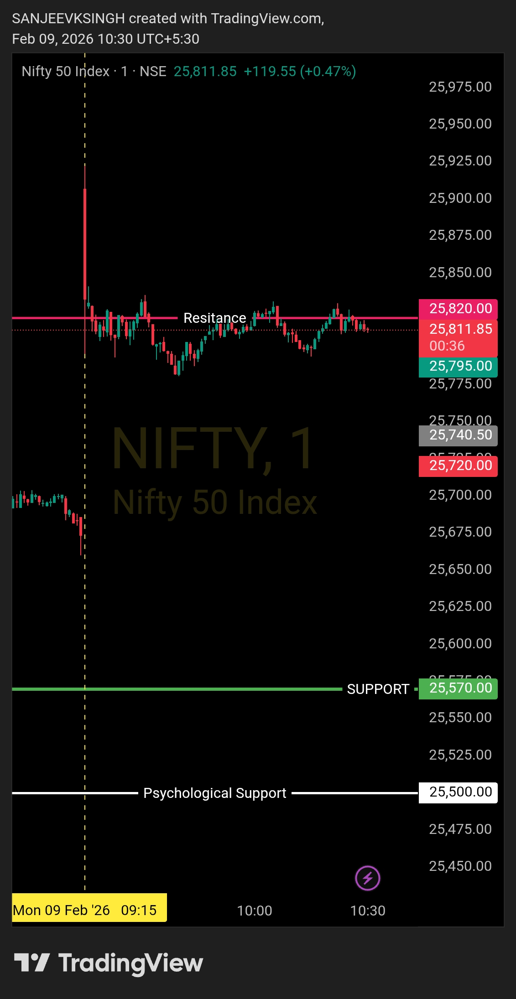

# Post-Market Summary — 9 Feb 2026

---

## The Plan

**Opening Zone:** 25570 – 25820  
**Bias:** Bullish - Buy side only  
**Rule:** If market opens inside the zone, wait for confirmation. Price needs to sustain above support and show bullish structure before taking any trade.

---

## What Actually Happened

**Opening:** 25888 (above the predefined zone)  
**The Rejection:** First candle itself started dropping, failed to sustain above resistance  
**Observation:** No 5-10 minute hold above 25820, immediate breakdown signal  
**Decision:** No trade taken  

Market opened at 25888 - outside my zone, above resistance at 25820. Plan was clear: this needs time to prove itself. But within the first candle itself, price started falling. No sustained move, no acceptance, no bullish structure.

---

## Why I Didn't Trade

Opening at 25888 looked tempting - gap up, above resistance, bullish sentiment everywhere. But here's the thing: my plan said opening zone is 25570-25820. This was outside.

The framework requires **acceptance and confirmation**. Price needs to hold, sustain, prove the breakout. Instead, the very first candle rejected. Within minutes, it was clear - this wasn't a breakout, this was a trap.

So I stayed out. Simple as that.

The plan said wait for structure. There was no structure. No trade.

---

## The Result

- **Trades taken:** 0
- **P&L:** ₹0
- **Capital preserved:** 100%
- **Money saved:** By not chasing a fake breakout

Most traders saw that 25888 opening and jumped in immediately thinking "gap up = buy". They got trapped. I waited, recognized the rejection, and stayed out.

---

## Bottom Line

Market opened outside my zone at 25888. First candle itself failed to sustain above 25820 resistance. No acceptance, no structure, no trade.

Framework said wait for confirmation. Price said this is not it. Discipline kept me safe.

No FOMO. No forcing trades. Just following the plan.

---

## Chart



**Opened above zone. Failed to sustain. Framework invalidated. Stayed out.**

---

## Disclaimer

This post is not shared in real time. As per SEBI guidelines, live market data or real-time trade updates are not posted. Observations are shared with a time delay during market hours, strictly for educational and journal documentation purposes.
```
