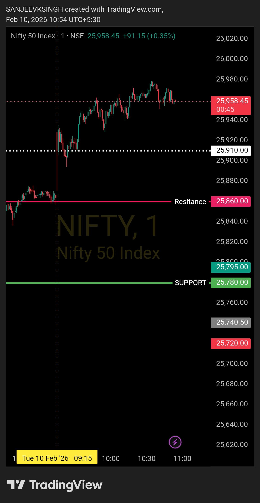

# Post-Market Summary — 10 Feb 2026

---

## The Plan

**Opening Zone:** 25780 – 25860  
**Bias:** Bearish - Sell side only  
**Rule:** If market opens inside the zone, wait for confirmation. If opens above 25860, price must reject and come back inside zone within 4-5 minutes for sell-side plan to remain valid.

---

## What Actually Happened

**Opening:** 25922 (way above the predefined zone)  
**Resistance Levels Broken:** Above 25860 (primary resistance) and even above 25910 (secondary resistance)  
**The Invalidation:** Market never came back to zone within 4-5 minutes  
**Decision:** No trade taken - Plan invalidated  

Market opened at 25922 - not just outside my zone, but above both resistance levels. Plan was crystal clear: if this happens, price must reject and come back inside 25780-25860 within 4-5 minutes. Otherwise, the sell-side framework is dead.

Price never came back. Bears never took control. Plan invalidated.

---

## Why I Didn't Trade

Opening at 25922 was a complete breach of the framework. Above 25860. Above 25910. This wasn't a minor gap - this was a structural break.

For the sell-side plan to work, sellers needed to reclaim control immediately. Price needed to reject 25922, drop back below 25860, and show bearish acceptance within the first 4-5 minutes.

That never happened.

Buyers held the higher ground. Bears didn't show up. Framework said: **if zone is not reclaimed, there is no sell-side setup.**

So I stayed out. No forcing. No "maybe it'll come back later." Plan invalidated = no trade.

---

## The Result

- **Trades taken:** 0
- **P&L:** ₹0
- **Capital preserved:** 100%
- **Framework respected:** 100%

This is the hardest part of trading - having a plan and watching the market do the exact opposite. But that's when discipline matters most.

Sell-side traders who ignored the framework and shorted anyway got crushed. I waited for my setup, didn't get it, and stayed out.

---

## Bottom Line

Market opened at 25922 - above both 25860 and 25910 resistance levels. For the bearish plan to execute, price had to come back inside 25780-25860 within 4-5 minutes. It didn't.

Framework invalidated. No sell setup. No trade.

Not every day gives you a trade. Some days test your discipline to **not** trade.

---

## Chart

**Opened way above zone. Never came back. Plan invalidated. Stayed out.**

---

## Disclaimer

This post is not shared in real time. As per SEBI guidelines, live market data or real-time trade updates are not posted. Observations are shared with a time delay during market hours, strictly for educational and journal documentation purposes.
