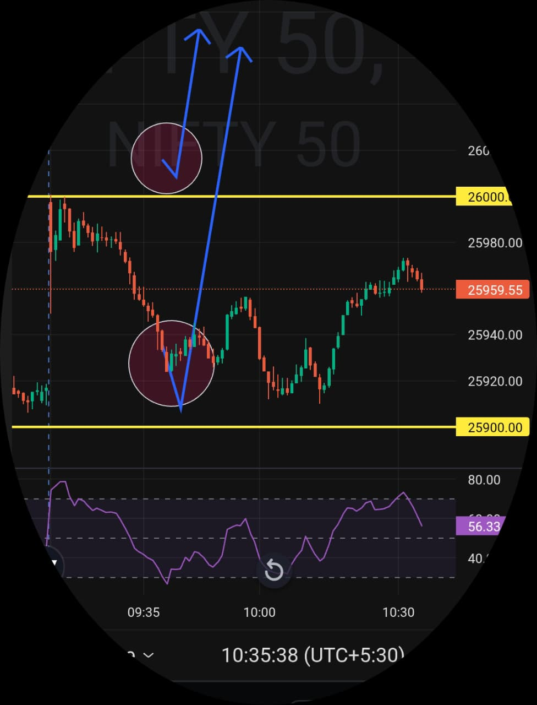

# Post-Market Summary — 11 Feb 2026

---

## The Plan

**Opening Zone:** 25900 – 26000  
**Bias:** Bullish - Buy side only  
**Rule:** If market opens inside the zone, wait for confirmation. Price needs to sustain above support and show bullish structure before taking any trade.

---

## What Actually Happened

**Opening:** 25997.45 (right inside the predefined zone, near resistance)  
**Initial Move:** Price fell from resistance (26000) towards support  
**The Confirmation:** 09:42 AM - Price held near 25900, showed bullish structure  
**Entry:** 09:42 AM - Buy side, SL 25900, Target 25975  
**Target Hit:** 10:42 AM (exactly 1 hour)  

Market opened exactly where I wanted it to - inside the 25900-26000 zone at 25997.45, almost touching the upper resistance. Initial move was downward from resistance, which was expected. This is where patience mattered.

Instead of chasing, I waited. Waited for price to reach 25900 support. That's where the setup was.

---

## Why This Trade Worked

Opening at 25997.45 was perfect - inside the zone but at the top end. The framework doesn't say "buy immediately at the open." It says wait for structure.

Price fell towards 25900 support. That's the level I was watching - the lower boundary of my zone, where buyers should defend.

By 09:42 AM, price reached 25900, showed rejection of lower prices, confirmed bullish structure. No guessing, no hoping - just waiting for the framework to set up properly.

Once confirmation came at support, entry was simple. 09:42 AM, buy side executed, stop loss at 25900, target at 25975. Clean setup, clear levels, no room for confusion.

Target hit at 10:42 AM. Exactly 1 hour, in and out. Framework worked exactly as planned.

---

## The Result

- **Trades taken:** 1
- **Entry:** 09:42 AM (near 25900 support after confirmation)
- **Exit:** 10:42 AM (target hit)
- **Duration:** 1 hour
- **Stop Loss:** 25900 (not triggered)
- **Target:** 25975 ✅ Hit

Market gave me exactly what the plan asked for - opening in zone, pullback to support at 25900, bullish confirmation at 09:42, clean execution, target reached at 10:42.

This is what following the framework looks like. Wait for your level, wait for confirmation, execute, manage.

---

## Bottom Line

Plan said bullish. Market opened in zone at 25997.45. Price fell to 25900 support. Waited for confirmation at 09:42. Got it. Executed buy side. Target hit at 10:42.

Framework validated. Patience rewarded. Discipline maintained.

Not every setup comes immediately at the open. Sometimes the best trades come after you wait for price to reach your level.

---

## Chart

**Opened in zone. Waited for support. Confirmation at 09:42. Executed. Target hit at 10:42.**

---

## Disclaimer

This post is not shared in real time. As per SEBI guidelines, live market data or real-time trade updates are not posted. Observations are shared with a time delay during market hours, strictly for educational and journal documentation purposes.
