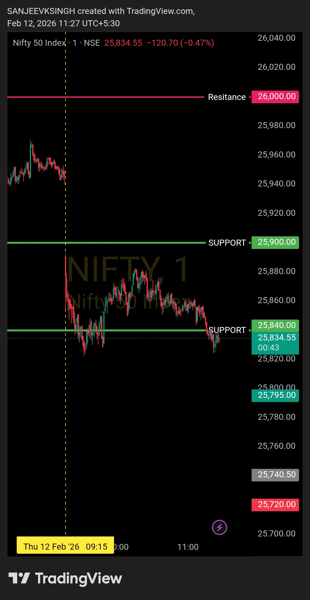

# Post Market Review — 12 Feb 2026

| **Market** | NIFTY50 |
|------------|---------|
| **Framework** | Opening Control Framework |
| **Opening Zone** | 25900 – 26000 |

---

## What Happened at the Open

**Opening:** 25,888.70  
**Previous Close:** 25,953.85  
**Day's Range:** 25,780.90 – 25,922.25

Market opened below 25,900. That's it. That's where the story ended.

---

## How the Framework Played Out

The morning plan was clear — if the market opens below 25,900, you wait 4–5 minutes and watch. Price needs to reject the breakdown, climb back above 25,900, and hold there with a strong bullish candle before you even think about entering.

None of that happened.

Market opened at 25,888.70, slipped further, and hit a low of 25,780.90. There was no reclaim. No rejection. No bullish confirmation. Just sustained downside pressure. The bull framework never activated.

**No trade. Correct call.**

---

## What About Going Short?

Price action was clearly bearish today — a short trade setup was sitting right there.

But here's the thing: I only take one trade a day. The plan coming in was bullish. When the bullish setup got invalidated, the day was done. Taking a bearish trade at that point would've been chasing the move in the opposite direction — exactly the kind of reactive, emotional execution the framework is built to prevent.

Passing on a trade you weren't set up for isn't a miss. It's the whole point.

---

## Bottom Line

No trade today — and that's a clean result, not a bad one.

The framework did exactly what it's supposed to do. Levels told the story, the bias followed the levels, and everything else got ignored. Discipline held.

Days like this don't show up in a P&L, but they absolutely show up in consistency over time.

---

## Core Principle — Unchanged

- **Levels decide**
- **Bias follows levels**
- **Everything else is noise**

---

## Chart / Image

---

## Disclaimer

This post is not shared in real time. As per SEBI guidelines, live market data or real-time trade updates are not posted. Observations are shared with a time delay during market hours, strictly for educational and journal documentation purposes.
