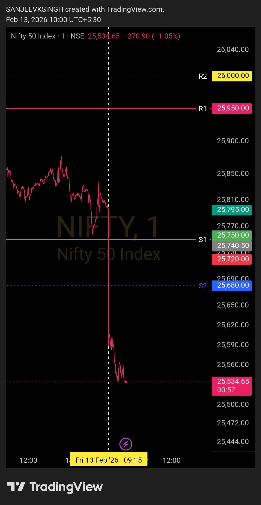

# Post-Market Summary — 13 Feb 2026

---

## The Plan

**Opening Zone:** 25750 – 25950  
**Bias:** Bullish - Buy side only  
**Rule:** If market opens inside the zone, wait for confirmation. Price needs to sustain above support and show bullish structure before taking any trade.

---

## What Actually Happened

**Opening:** 25571.15 (gap-down, well below the predefined zone)  
**Gap:** ~236 points below previous close of 25807.20 (0.91% drop)  
**Decision:** No trade taken - Framework invalidated  

Market opened at 25571.15 — nearly 180 points below my zone's lower boundary of 25750. Not a minor miss. A clear, decisive gap-down that put the entire bull framework under pressure from the first second.

---

## Why I Didn't Trade

The noise today was loud. Global markets saw gold and silver crash, sentiment was shaky, and everyone had an opinion. But here's the thing — **that's all noise.**

My framework is simple: price needs to open inside 25750-25950 for the buy-side plan to be valid. It didn't. End of story.

25571.15 is not 25750. The zone wasn't given. The setup wasn't there. No amount of reasoning, no global macro explanation, no "but it might recover" changes that fact.

For the bull plan to even consider execution after a gap-down, price had to reclaim 25750 within 4-5 minutes with strong bullish structure. That window came and went. Zone was never reclaimed.

No zone. No trade.

---

## The Result

- **Trades taken:** 0
- **P&L:** ₹0
- **Capital preserved:** 100%
- **Framework respected:** 100%

Global noise — gold crash, silver crash, weak sentiment — triggered panic buying and selling across the board. Traders who ignored the gap and bought anyway took unnecessary risk in a structurally weak open.

I waited for my zone. My zone never came. I stayed out.

---

## Bottom Line

Market gapped down 236 points and opened at 25571.15. My bull zone was 25750-25950. Price never came back to zone.

Gold crashed. Silver crashed. World markets bled. But none of that changes my framework.

**Levels decide. Not news. Not noise. Not global markets.**

Zone wasn't given today. That's the only reason needed to stay out.

---

## Chart

**Gap-down open. Zone never reached. Framework invalidated. Capital protected.**

---

## Disclaimer

This post is not shared in real time. As per SEBI guidelines, live market data or real-time trade updates are not posted. Observations are shared with a time delay during market hours, strictly for educational and journal documentation purposes.
