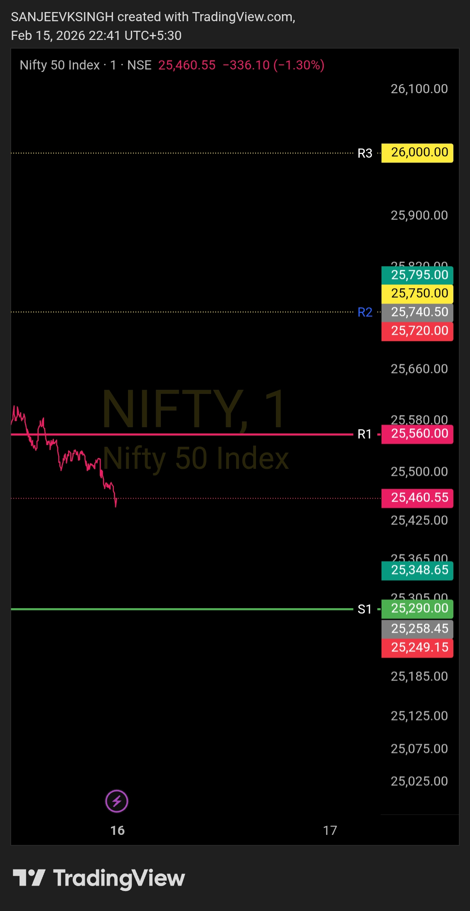
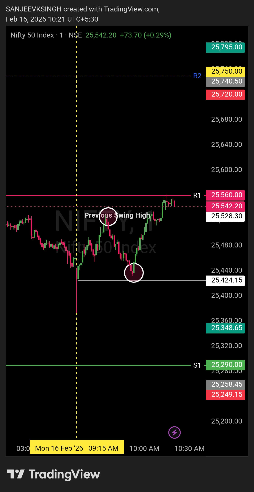

# Morning Plan — 16 Feb 2026

| **Market** | NIFTY50 |
|------------|---------|
| **Framework** | Opening Control Framework |
| **Opening Zone** | 25560 – 25290 |

**That's the only focus.**  
Everything else is commentary.  
Levels decide. Noise doesn't.

---

## Bias
**Bearish**

## Trade Direction
**Sell side only**

If NIFTY50 opens anywhere inside this zone, there is no guessing.  
Market intent is defined by acceptance within the opening range.

---

## Execution Logic

- **Opening between 25290 & 25560** → bearish control intact
- **Opening above 25560** → wait 4-5 minutes, observe price action:
  - Price must NOT sustain above resistance
  - Must reject and fall back below the predefined zone (25560)
  - Bear plan executes only with a strong bear-supporting candle confirmation
- No counter-trend trades
- No anticipation, only reaction

---

## Acceptance Rule

As long as price accepts **below 25560**,  
the sell-side framework remains valid.

**If opening above 25560:**  
Monitor for 4-5 minutes — price should reject the breakout, move back below resistance, and sustain with bearish confirmation before entering sell-side trades.

---

## Opening Preference

**Ideal opening:** Flat to gap-down inside the zone.  
A flat or gap-down opening keeps risk controlled and confirms bearish intent from the start.

**If market opens flat (near yesterday's close):** Risk increases. Price is more likely to test higher levels before finding direction. Caution required — wait for stronger confirmation before entering.

**If market opens gap-up above 25560:** Framework is under stress. Higher risk, lower conviction. Only enter if price strongly rejects zone with clear bearish structure.

---

## Trade Management

- Pullbacks / bounces are sell opportunities
- No bottom calling
- No emotional execution

---

## Core Principle

- **Levels decide**
- **Bias follows levels**
- **Everything else is noise**

---

## Chart / Image

---

## Video Reference

[Watch Morning Plan Video](./2026-02-16-nifty50-morning-plan.mp4)

---

## Disclaimer

This post is not shared in real time.  
As per SEBI guidelines, live market data or real-time trade updates are not posted.  
Observations are shared with a time delay during market hours, strictly for educational and journal documentation purposes.

---
---

# Post Market Journal — 16 Feb 2026

## Trade Summary

| Field | Detail |
|-------|--------|
| **Instrument** | NIFTY50 |
| **Direction** | Short (Sell) |
| **Entry Time** | 9:36 AM IST |
| **Entry Price** | 25518 |
| **Entry Trigger** | Previous swing high — bearish rejection |
| **Stop Loss** | 25560 (R1) |
| **Risk** | 42 points |
| **Target** | 25424 (9:16 AM 1-min candle low) |
| **Reward** | 94 points |
| **R:R Achieved** | 1 : 2.24 ✅ |
| **Exit Time** | 9:54 AM IST |
| **Exit Price** | 25424 |
| **Trade Duration** | 18 minutes |
| **Outcome** | **Target Hit — Profitable** |

---

## Execution Review

**Entry — 9:36 AM @ 25518**  
Short triggered at the previous swing high. Price offered clean resistance at this level — no chasing, no anticipation. Entry was purely reactive. The level was inside the opening control zone, bearish bias intact from the pre-market plan.

**Stop Loss — 25560 (R1)**  
SL placed at R1, the next meaningful resistance above entry. Risk was fixed at 42 points before the trade was taken. No adjustment post-entry.

**Target — 25424 (9:16 AM 1-min candle low)**  
A structural reference level — the low of the 9:16 AM candle on the 1-minute timeframe. Not arbitrary. The market delivered this level by 9:54 AM.

**Exit — 9:54 AM @ 25424**  
Clean exit at target. No overstaying. No second-guessing. The plan was written before market open — execution matched the plan exactly.

---

## Framework Alignment Check

| Rule | Status |
|------|--------|
| Opening inside bearish zone (25290–25560) | ✅ |
| Sell-side bias maintained throughout | ✅ |
| Entry on reaction, not anticipation | ✅ |
| SL defined before entry | ✅ |
| Target structural, not arbitrary | ✅ |
| No counter-trend trades | ✅ |
| No emotional execution | ✅ |

**7 / 7 — Framework followed completely.**

---

## What Worked

The opening control zone held its structure exactly as laid out in the pre-market plan. The previous swing high at 25518 acted as textbook resistance — price hit the level, showed rejection, and the short triggered cleanly. Holding through the 18-minute move without panic or early exit was the discipline that delivered the 1:2.24 R:R. Using the 9:16 AM candle low as the target kept the exit objective and completely free of emotion.

---

## Lesson / Reminder

> The plan took 30 minutes to build.  
> The trade took 18 minutes to complete.  
> But the real work was done before the market opened.
>
> Entry was structural. Exit was structural. Nothing in between was guesswork — only patience.  
> That is the framework. That is the edge.

---

## Post Market Chart

---

## Next Day Outlook — 17 Feb 2026

**Bias:** To be determined  
**Note:** No bias committed for 17 Feb at this stage. The morning plan will be published based on fresh price action, overnight developments, and a clean level re-assessment before market open.

> Levels first. Bias second. There is no rush to decide.

---

## Disclaimer

This post is not shared in real time.  
As per SEBI guidelines, live market data or real-time trade updates are not posted.  
Observations are shared with a time delay during market hours, strictly for educational and journal documentation purposes.

