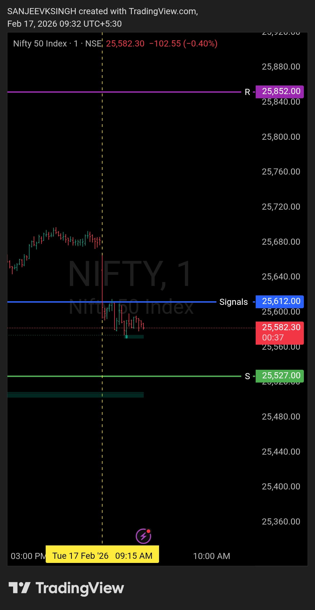

# Post Market Review — 17 Feb 2026

| **Market** | NIFTY50 |
|------------|---------|
| **Framework** | Opening Control Framework |
| **Timeframe** | 1 Minute |
| **Opening Zone** | 25612 – 25852 |

---

## Key Levels

| | Price |
|---|---|
| **Prev Day Close** | 25,682.75 |
| **Today's Open** | 25,637.95 |
| **Today's Close** | 25,605.85 |

---

## Opening Analysis

Today's open at **25,637.95** was **below previous day's close (25,682.75)** — a minor gap-down.

Price opened inside the zone but below the key support of **25,612**.

---

## What Happened

Within the first 5-6 minutes, market showed continuous selling pressure.

Price could not bounce back above **25,612**.

Instead of rejecting and recovering, price **sustained below 25,612** — which was the critical condition for the bullish plan to remain valid.

---

## Plan vs Reality

| Condition | Expected | Actual |
|---|---|---|
| Opening | Inside zone | 25,637.95 — minor gap-down |
| Price behavior above 25,612 | Sustain and buy | Failed to sustain |
| Bullish confirmation | Strong bullish candle | Not seen |
| Plan status | Execute buy-side | **Invalidated** |

---

## Decision

**No trade taken. Correct call.**

As per the framework — if price opens below 25,612 and fails to bounce back with confirmation within 4-5 minutes, the bullish plan is off the table.

Price did exactly that. Sustained below support. No setup. No entry.

---

## Key Takeaway

> Levels decided. Price stayed below 25,612. Plan followed price — not emotions.
> Staying out was the trade.

---

## Chart / Image

---

## Video Reference

[Watch Post Market Review Video](./2026-02-17-nifty50-post-market-review.mp4)

---

## Disclaimer

Not shared in real time. Posted with time delay as per SEBI guidelines for educational purposes only.
