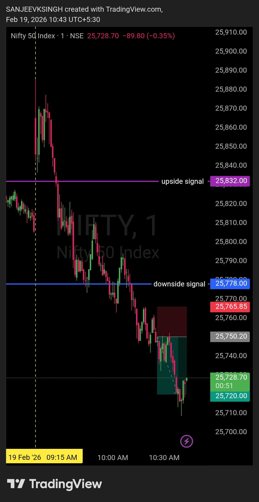

# Post Market Journal — 19 Feb 2026

## Morning Plan Recap

| **Market** | NIFTY50 |
|------------|---------|
| **Framework** | Neutral Zone Framework |
| **Bullish Trigger** | Above 25832 (must sustain 5-15 min) |
| **Bearish Trigger** | Below 25778 (must sustain 5-15 min) |
| **No Trade Zone** | 25778 – 25832 |

**Plan Logic:**  
- Opening above 25832 + sustaining → Bullish bias, buy side only
- Opening below 25778 + sustaining → Bearish bias, sell side only
- Opening between 25778–25832 → No trade, wait for breakout
- Sustenance requirement: 5-15 minutes beyond trigger level

---

## Trade Summary

| Field | Detail |
|-------|--------|
| **Instrument** | NIFTY50 |
| **Direction** | Short (Sell) |
| **Breakdown Time** | 10:11 AM IST |
| **Breakdown Level** | Below 25778 |
| **Sustenance Check** | 10:11 - 10:26 AM (15 minutes) ✅ |
| **Entry Time** | 10:26 AM IST |
| **Entry Price** | 25750 |
| **Stop Loss** | 25765.85 |
| **Risk** | 15.85 points |
| **Target** | 25720 |
| **Reward** | 30 points |
| **R:R Achieved** | 1 : 1.89 ✅ |
| **Exit Time** | 10:38 AM IST |
| **Exit Price** | 25720 |
| **Trade Duration** | 12 minutes |
| **Outcome** | **Target Hit — Profitable** |

---

## What Happened

### Opening — 9:15 AM @ 25873.35
Market opened above the bullish trigger level of 25832. Initial setup suggested potential bullish bias if price sustained above this level for 5-15 minutes.

### Failed Sustenance — 9:15 - 9:30 AM
Price failed to hold above 25832. Within the first 15 minutes, NIFTY50 broke down and entered the no-trade zone between 25778 and 25832. Bullish scenario invalidated as per framework rules.

### No Trade Zone — 9:30 - 10:11 AM
Price remained inside the neutral zone (25778–25832). No trades taken during this period. Framework rules respected — waiting for clean breakout with proper sustenance.

### Breakdown — 10:11 AM
Price broke below the bearish trigger level of 25778. This initiated the 5-15 minute sustenance observation window required by the framework.

### Sustenance Confirmation — 10:11 - 10:26 AM
Price sustained below 25778 for 15 minutes without bouncing back into the no-trade zone. Bearish framework confirmed. Trade setup validated.

### Entry — 10:26 AM @ 25750
Short position entered at 25750 after clean breakdown confirmation. Entry was reactive, not anticipatory. Stop loss placed at 25765.85, risk fixed at 15.85 points. Target set at 25720 for 30 points reward (R:R 1:1.89).

### Exit — 10:38 AM @ 25720
Target hit in 12 minutes. Clean exit with no emotional interference. Framework executed perfectly from start to finish.

---

## Framework Alignment Check

| Rule | Status |
|------|--------|
| Opening above 25832 observed | ✅ |
| Waited 5-15 min for sustenance check | ✅ |
| Price failed to sustain above 25832 | ✅ (Bullish invalidated) |
| Entered no-trade zone — did not force trade | ✅ |
| Waited for breakdown below 25778 | ✅ |
| Breakdown sustained 5-15 min (10:11-10:26) | ✅ |
| Entry on confirmation, not anticipation | ✅ |
| SL defined before entry | ✅ |
| Target structural and predefined | ✅ |
| No emotional execution | ✅ |

**10 / 10 — Framework followed completely.**

---

## Why This Trade Worked

### Patience Through Failed Setup
The opening above 25832 could have led to an impulsive long entry. The framework's sustenance rule filtered this out. When price failed to hold, there was no emotional reaction — just clean observation.

### No Trade Zone Discipline
Between 9:30 AM and 10:11 AM, price chopped inside the neutral zone. No trades were forced. This patience preserved capital and kept focus sharp for the eventual setup.

### Proper Breakdown Confirmation
At 10:11 AM, price broke below 25778. Instead of jumping in immediately, the framework required 5-15 minutes of sustenance. This waiting period eliminated false breakdowns and confirmed genuine bearish momentum.

### Reactive Entry, Not Predictive
Entry at 10:26 AM came only after 15 minutes of sustained breakdown. This was not guessing. This was reacting to confirmed structure.

### Predefined Risk and Target
SL at 25765.85 and target at 25720 were set before entry. No adjustments. No second-guessing. The trade ran its course according to plan.

---

## What Worked

**The framework filtered noise and captured structure.**  
Opening fakeout was avoided. No-trade zone was respected. Breakdown was confirmed. Entry was clean. Exit was mechanical.

**Discipline over impulse.**  
The first 90 minutes had no valid setup. Most traders would have forced a trade out of boredom or FOMO. The framework kept emotions in check.

**Sustenance rule = Edge.**  
Without the 5-15 minute confirmation window, the entry would have been rushed and likely stopped out. The waiting period turned a potential fakeout into a high-probability setup.

---

## Lesson / Reminder

> The market opened at 9:15 AM.  
> The trade triggered at 10:26 AM.  
> That's 71 minutes of waiting.
> 
> Most traders can't wait 71 minutes.  
> That's why most traders lose.
> 
> The framework didn't predict the breakdown.  
> It just waited for the breakdown to prove itself.  
> Then it reacted.
> 
> Patience isn't passive. Patience is preparation meeting opportunity.

---

## Post Market Chart

---

## Next Day Outlook — 20 Feb 2026

**Bias:** To be determined  
**Note:** No bias committed for 20 Feb at this stage. The morning plan will be published based on fresh price action, overnight developments, and a clean level re-assessment before market open.

> Levels first. Bias second. There is no rush to decide.

---

## Disclaimer

This post is not shared in real time.  
As per SEBI guidelines, live market data or real-time trade updates are not posted.  
Observations are shared with a time delay during market hours, strictly for educational and journal documentation purposes.
