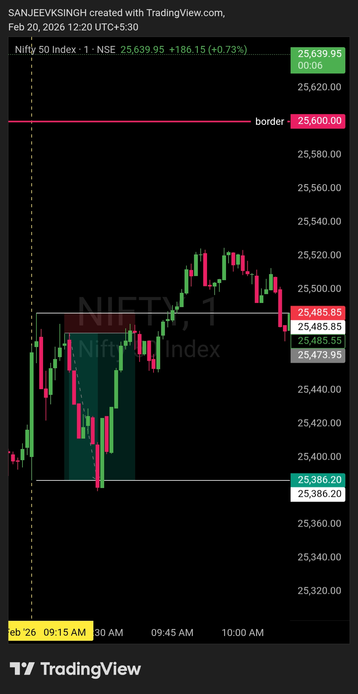

# Post Market Journal — 20 Feb 2026

## Morning Plan Recap

| **Market** | NIFTY50 |
|------------|---------|
| **Framework** | Bearish Control Framework |
| **Key Resistance** | 25600 |
| **Bias** | Bearish (unless major gap-up above 25600) |
| **Trade Direction** | Sell side only |

**Plan Logic:**  
- Opening below 25600 → Bearish bias intact, sell-side trades only
- Major gap-up above 25600 → Framework invalidated, wait & observe
- Default stance: Bearish unless market structure proves otherwise

---

## Trade Summary

| Field | Detail |
|-------|--------|
| **Instrument** | NIFTY50 |
| **Direction** | Short (Sell) |
| **Entry Time** | 9:23 AM IST |
| **Entry Price** | 25485.85 |
| **Stop Loss** | 25497.75 |
| **Risk** | 11.90 points |
| **Target** | 25386.20 |
| **Reward** | 99.65 points |
| **R:R Achieved** | 1 : 8.37 ✅ |
| **Exit Time** | 9:29 AM IST |
| **Exit Price** | 25386.20 |
| **Trade Duration** | 6 minutes |
| **Outcome** | **Target Hit — Exceptional Execution** |

---

## What Happened

**Market Opening**  
NIFTY50 opened below the key resistance level of 25600. Bearish framework remained intact from the pre-market plan. No major gap-up occurred, confirming that the default bearish bias was valid.

**Entry — 9:23 AM @ 25485.85**  
Short position triggered at 25485.85. Entry was clean and reactive based on bearish structure confirmation.

**Stop Loss — Swing High @ 25497.75**  
Stop loss was placed at the swing high on the 1-minute chart. This was the most recent structural resistance, making it a logical invalidation point for the bearish setup. Risk was kept tight at just 11.90 points.

**Target — Swing Low @ 25386.20**  
Target was set at the swing low on the 1-minute chart. This was a structural support level where price had previously found demand. Using swing low as target gave the trade a logical exit point based on price structure, not arbitrary numbers.

**Target Execution — 9:29 AM @ 25386.20**  
Market moved sharply in the anticipated direction. Target was hit in just 6 minutes with a massive 99.65 points reward, delivering an exceptional R:R of 1:8.37.

**Exit — 9:29 AM @ 25386.20**  
Clean exit at target. No hesitation. No greed. Plan was executed mechanically from entry to exit.

---

## Framework Alignment Check

| Rule | Status |
|------|--------|
| Opening below 25600 (bearish bias valid) | ✅ |
| No major gap-up above resistance | ✅ |
| Entry on bearish structure confirmation | ✅ |
| SL defined and tight (11.90 pts) | ✅ |
| Target predefined before entry | ✅ |
| No counter-trend trades attempted | ✅ |
| Exit at target without emotion | ✅ |

**7 / 7 — Framework followed completely.**

---

## Why This Trade Worked

### Bearish Framework Confirmed from Open
The market opened below 25600, exactly as the plan anticipated. There was no gap-up confusion, no whipsaw — just clean bearish structure from the start.

### Tight Risk, Massive Reward
Risk was kept minimal at 11.90 points while the market delivered 99.65 points of movement. This wasn't luck — this was structure aligning with strong momentum.

### Structural Stop Loss and Target
Stop loss was placed at swing high (25497.75) — a logical structural invalidation point on the 1-minute chart. Target was set at swing low (25386.20) — a clear structural support level. Both levels were based on price structure, not guesswork. This gave the trade a solid technical foundation from entry to exit.

### 6-Minute Execution
The trade didn't require hours of monitoring. Entry at 9:23 AM, exit at 9:29 AM. Speed and precision.

### No Emotional Interference
Target was predefined. When price reached 25386.20, the exit was mechanical. No second-guessing, no "what if it goes lower" — just clean execution.

---

## What Worked

**The framework filtered noise and captured structure.**  
Bearish bias was validated from the opening bell. No hesitation, no confusion. The plan was clear, and execution matched the plan.

**Tight stop loss = Confidence.**  
A 11.90-point SL allowed for high conviction without excessive risk. This is what proper risk management looks like — protecting capital while giving the trade room to work.

**Exceptional R:R delivered by market momentum.**  
The 1:8.37 risk-reward wasn't forced. The market gave it. The framework just positioned correctly to capture it.

---

## Lesson / Reminder

> 6 minutes.  
> 1 trade.  
> 1:8.37 risk-reward.
> 
> This is what happens when:  
> - The plan is clear before the market opens  
> - The entry is reactive, not predictive  
> - The stop loss is at swing high (structural resistance)  
> - The target is at swing low (structural support)  
> - The exit is mechanical, not emotional
> 
> Swing high gave the SL.  
> Swing low gave the target.  
> The market gave the rest.
> 
> Trading isn't about hours of screen time.  
> It's about preparation meeting opportunity.  
> 
> Most traders would have exited at 1:1 or 1:2.  
> The framework let the trade breathe.  
> The structure delivered the exceptional R:R.

---

## Post Market Chart

---

## Next Day Outlook — 21 Feb 2026

**Bias:** To be determined  
**Note:** No bias committed for 21 Feb at this stage. The morning plan will be published based on fresh price action, overnight developments, and a clean level re-assessment before market open.

> Levels first. Bias second. There is no rush to decide.

---

## Disclaimer

This post is not shared in real time.  
As per SEBI guidelines, live market data or real-time trade updates are not posted.  
Observations are shared with a time delay during market hours, strictly for educational and journal documentation purposes.
