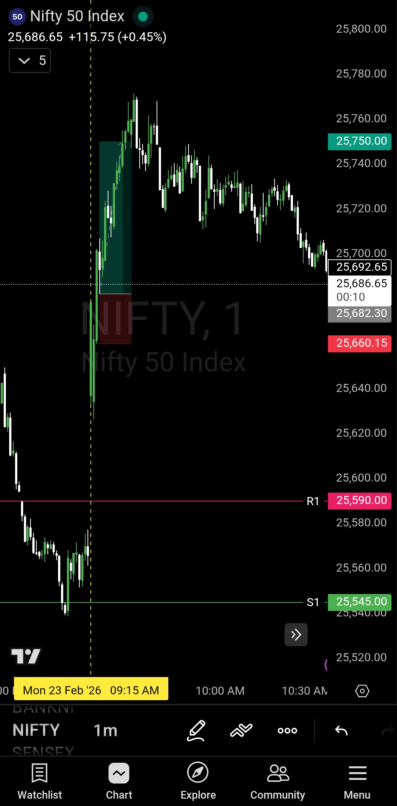

# Post Market Journal — 23 Feb 2026

## Morning Plan Recap

| **Market** | NIFTY50 |
|------------|---------|
| **Framework** | Opening Control Framework |
| **Bullish Zone** | 25590 and above |
| **Bearish Zone** | Below 25545 |
| **No Trade Zone** | 25545 – 25590 |

**Plan Logic:**  
- Opening above 25590 + sustaining 5-15 min → Buyers in control, buy side only
- Opening below 25545 + sustaining 5-15 min → Sellers in control, sell side only
- Opening between zones → No trade, wait for breakout

---

## Trade Summary

| Field | Detail |
|-------|--------|
| **Instrument** | NIFTY50 |
| **Direction** | Long (Buy) |
| **Entry Time** | 9:18 AM IST |
| **Entry Price** | 25682 |
| **Stop Loss** | 25660 |
| **Risk** | 22 points |
| **Target** | 25750 |
| **Reward** | 68 points |
| **R:R Achieved** | 1 : 3.09 ✅ |
| **Exit Time** | 9:26 AM IST |
| **Exit Price** | 25750 |
| **Trade Duration** | 8 minutes |
| **Outcome** | **Target Hit — Clean Execution** |

---

## What Happened

**Market Opening — Above 25590**  
NIFTY50 opened in the bullish zone, above the 25590 trigger level. This immediately put buyers in control according to the framework. The opening told us which side to focus on.

**5-15 Minute Observation**  
Price sustained above 25590 during the critical observation window. No breakdown. No whipsaw. Bullish structure confirmed. The framework gave the green light for buy-side trades only.

**Entry — 9:18 AM @ 25682**  
Long position entered at 25682 after confirming bullish control. The entry came quickly because the 9:17 AM candle was a full-body bullish bar — strong momentum with minimal rejection. This type of candle structure signals conviction, not hesitation. Entry was reactive to this price action, not predictive. Stop loss placed at 25660 — tight risk at just 22 points. Target set at 25750 for 68 points reward, giving an R:R of 1:3.09.

**Target Hit — 9:26 AM @ 25750**  
Market moved cleanly in the anticipated direction. Target was hit in 8 minutes. No drama. No second-guessing. Just mechanical execution from entry to exit.

---

## Framework Alignment Check

| Rule | Status |
|------|--------|
| Opening above 25590 (bullish zone) | ✅ |
| Waited 5-15 min for sustenance check | ✅ |
| Price sustained above 25590 | ✅ |
| Buyers confirmed in control | ✅ |
| Entry on buy side only (no shorting) | ✅ |
| SL defined before entry (25660) | ✅ |
| Target predefined before entry (25750) | ✅ |
| Exit at target without emotion | ✅ |

**8 / 8 — Framework followed completely.**

---

## Why This Trade Worked

### Opening Zone Gave Direction
The market opened above 25590. That single data point told us buyers were in control. There was no guessing. The plan was already written before the bell rang.

### Sustenance Confirmed Control
Between opening and 9:18 AM, price held above 25590. This wasn't luck — it was confirmation. The framework's 5-15 minute rule filtered out false starts and validated bullish momentum.

### Tight Risk, Strong Reward
22 points of risk. 68 points of reward. R:R of 1:3.09. This isn't about taking massive risks — it's about positioning correctly when structure aligns with momentum.

### Full-Body Bullish Candle = Conviction
The 9:17 AM candle was a big-bodied bullish bar with minimal wicks. This wasn't a doji or indecision candle — it was momentum showing its hand. Full-body candles signal conviction. When you see that after confirming the opening zone, it's a green light for entry. That's why the trade triggered at 9:18 AM, just one minute later.

### 8-Minute Execution
Entry at 9:18 AM. Exit at 9:26 AM. The trade didn't need hours of monitoring. Clean setup, clean execution, clean exit.

---

## What Worked

**The framework filtered noise and captured structure.**  
Opening above 25590 wasn't a signal to blindly buy. It was a signal to watch for confirmation. Once confirmation came, the entry was obvious.

**Pullback = opportunity, not fear.**  
If there had been a pullback to 25590 after entry, that would have been a reload zone, not a reason to panic. The framework keeps your head clear when price moves against you briefly.

**Discipline kept emotions out.**  
Target at 25750 was predefined. When price hit it at 9:26 AM, there was no debate. Exit was mechanical. No "what if it goes higher" thoughts.

---

## Lesson / Reminder

> 8 minutes.  
> 1 trade.  
> 1:3.09 risk-reward.
> 
> The opening zone gave direction.  
> The sustenance check gave confirmation.  
> The 9:17 AM full-body bullish candle gave the trigger.  
> The entry was reactive.  
> The exit was mechanical.
> 
> Big-bodied candles with minimal wicks = conviction.  
> Dojis and wicks = hesitation.  
> Know the difference.
> 
> This is what happens when you stop predicting and start reacting.  
> The market will tell you what it wants to do.  
> Your job is to listen and execute.

---

## Post Market Chart

---

## Next Day Outlook — 24 Feb 2026

**Bias:** To be determined  
**Note:** No bias committed for 24 Feb at this stage. The morning plan will be published based on fresh price action, overnight developments, and a clean level re-assessment before market open.

> Levels first. Bias second. There is no rush to decide.

---

## Disclaimer

This plan is shared either before market hours or with a time delay during market hours, in compliance with SEBI guidelines. Live market data is not shared in real time.

This is not investment advice. Shared purely for educational and personal journaling purposes.

---

**— Sanjeev Singh**
