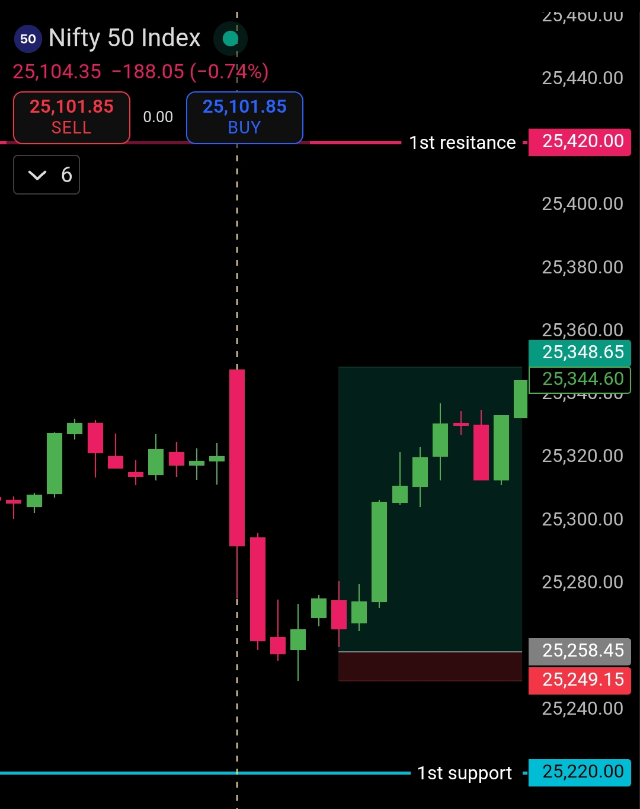

# Post-Market Observation — 23 Jan 2026

**Instrument:** NIFTY50  
**Entry Time:** 9:21 AM  
**Exit Time:** 9:29 AM  

---

## Context / Pre-Plan Recap
- Pre-market plan centered on **25220 boundary**  
- Below 25220 → Bears in control  
- Above 25220 → Bulls take control  
- Market opened below the boundary but reclaimed it within first 5 minutes  

---

## Trade Execution
- Took **pre-entry at 9:21 AM** after observing boundary reclaim  
- Exited at **9:29 AM** following tactical R:R  
- Execution aligned perfectly with pre-market plan  

---

## Market Behavior Observed
- Early reclaim of **25220** boundary gave high conviction  
- Price action was clean, minimal noise  
- Setup matched pre-plan; no second guessing  

---

## Emotion / State
- Calm, focused, and disciplined  
- Confident in level-based execution  

---

## Lessons / Notes
- Boundary reclaim signals are reliable for early entries  
- Strict adherence to pre-market plan avoids emotional trades  
- Tactical R:R exit preserved capital while securing gain  

---

## Image / Chart

---

**Daily Verdict:** ✅ Trade executed as planned
