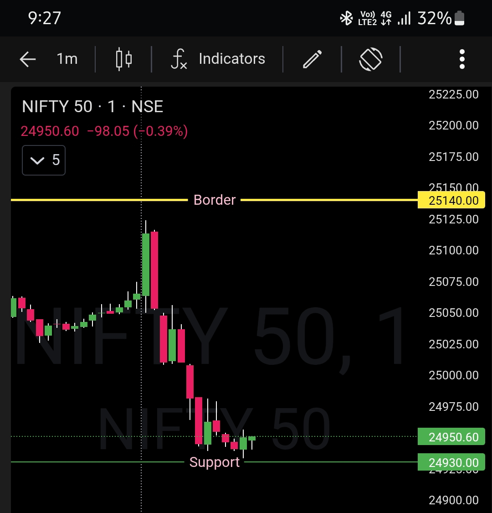

# Post-Market Observation — 27 Jan 2026

## Instrument
NIFTY50

## Trade Window
- Entry: 9:16 AM  
- Exit: 9:26 AM  

## Context / Pre-Plan Reference
Pre-market plan was built around **25140 boundary**.

- Below 25140 → Bears were in control  
- Above 25140 → Bulls were expected to take control  

Market behavior was evaluated strictly around this level.

## Market Behavior Observed
- Price interaction around **25140** defined opening control  
- Acceptance above the level confirmed bullish authority  
- No violation of framework rules observed  

## Execution Review
- Trade execution aligned with pre-market bias  
- No anticipation or emotional deviation  
- Decisions were level-driven, not reactive  

## Emotion / State
- Calm and focused  
- Confident in process execution  

## Notes
- Framework held, noise ignored  
- Levels dictated decisions  
- No second guessing, no overtrading  

---

## Image / Chart

