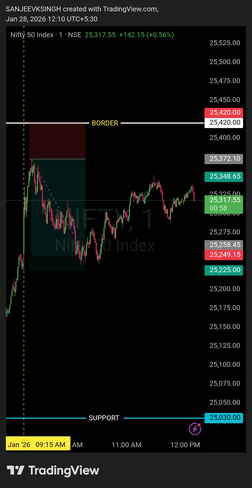

# Market Journal — 28 Jan 2026

## Instrument
NIFTY50

## Market Framework
Opening Control Read

---

## Pre-Market Plan (Reference)

### Context
Pre-market plan was built around **25420 boundary** (first resistance).

- Below 25420 → Bears in control  
- Above 25420 → Bulls take control  

This level was expected to define opening control and directional authority.

### Execution Bias
- Trade only after **clear control confirmation**
- No anticipation, no emotional trades
- Let the level decide

---

## Post-Market Observation

### Market Behavior
- Market **opened below 25420**, confirming initial bearish context  
- First **5–7 minutes were observed** without taking any action  
- Price attempted to move higher but repeatedly faced **rejection near 25420**  
- Rejection behavior validated bearish control  

### Trade Execution
- **Put side entry at 9:31 AM**, post rejection confirmation  
- Trade aligned strictly with pre-market level logic  
- **Exit at 10:08 AM**, maintaining predefined **risk:reward**  
- No impulsive or reactive decisions  

### Emotion / State
- Calm and patient  
- Fully focused on execution, not outcome  

### Notes
- Patience during the opening phase prevented premature entries  
- Levels dictated decisions, not opinions  
- Clean execution with no overtrading  

---

## Chart / Image

---

## Disclaimer
This post is **not shared in real time**.  
As per SEBI guidelines, live market data or real-time trade updates are not posted.  
Observations are shared with a **time delay during market hours**, strictly for educational and journal documentation purposes.
