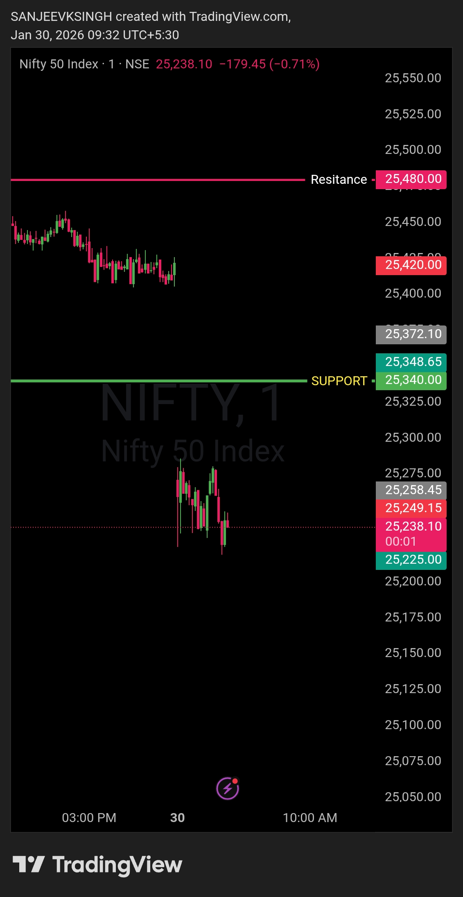

# Post-Market Review — 30 Jan 2026

NIFTY50 | Opening Control Framework

**Pre-Plan Zone (Bull Bias): 25340 – 25480**

- Market opened **below the opening zone** → bull-side edge not validated  
- System rules strictly **no-trade outside zone**  
- Price respected framework → disciplined observation

**Execution Outcome:**

- No trades executed  
- System remained inactive → **strict adherence to pre-defined edge**  
- Market structure at open indicated **neutral/bearish bias** → bull-side entries invalid

**Post-Session Observations:**

- Avoiding trades outside the validated zone **prevents early losses**  
- Discipline in following the plan is **more important than forced execution**  
- “No trade” events are **crucial for statistical audit of edge vs noise**

**Key Takeaways:**

- **Edge adherence:** Only trade within predefined zones  
- **System integrity:** No execution is better than low-probability trades  
- **Market validation:** Always check opening range before triggering trades  
- **Post-trade audit:** Record all “No trade” events for backtesting

---

## Chart / Image

## Video Reference
<video width="600" controls>
  <source src="./2026-01-30-nifty50-post.mp4" type="video/mp4">
  Your browser does not support the video tag.
</video>

---

## Disclaimer
This post is **not shared in real time**.  
As per **SEBI guidelines**, live market data or real-time trade updates are not posted.  
Observations are shared with a **time delay during market hours**, strictly for **educational and journal documentation purposes**.
