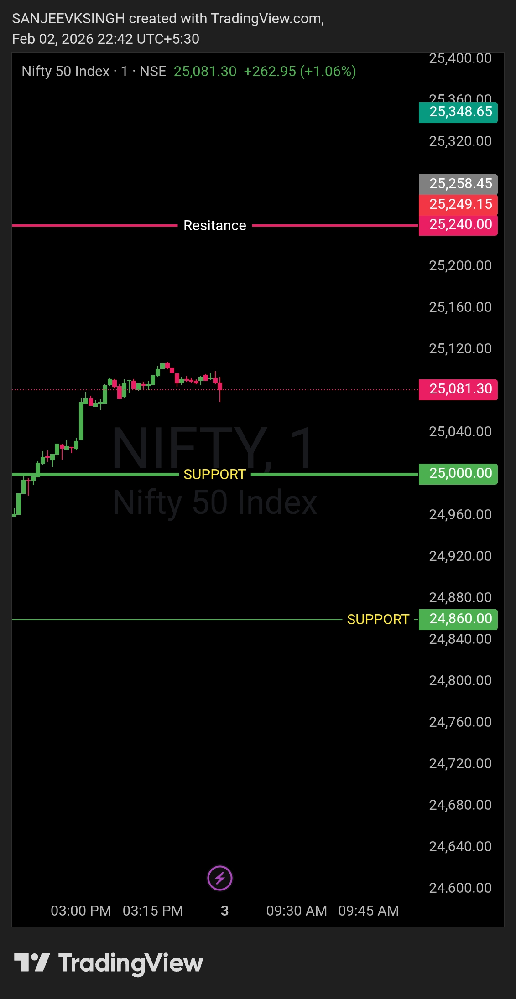

# Morning Plan — 3 Feb 2026

## Market
**NIFTY50**

## Framework
**Opening Control Framework**

## Opening Zone
**25000 – 25240**

That’s the only focus.  
Everything else is commentary.  
**Levels decide. Noise doesn’t.**

## Bias
**Bearish**

## Trade Direction
**Sell side only**

If NIFTY50 opens anywhere inside this zone, there is **no guessing**.  
Market intent is defined by **acceptance within the opening range**.

## Execution Logic
- Opening between **25000 & 25240** → bearish control intact  
- No counter-trend trades  
- No anticipation, only reaction  

## Acceptance Rule
As long as price **accepts below 25240**,  
the sell-side framework remains valid.

## Trade Management
- Pullbacks are **sell opportunities**
- No bottom fishing
- No emotional execution

## Core Principle
- Levels decide  
- Bias follows levels  
- Everything else is noise  

---

## Chart / Image

## Video Reference
<video width="600" controls>
  <source src="./2026-02-03-nifty50-pre.mp4" type="video/mp4">
  Your browser does not support the video tag.
</video>

---

## Disclaimer
This post is **not shared in real time**.  
As per **SEBI guidelines**, live market data or real-time trade updates are not posted.  
Observations are shared with a **time delay during market hours**, strictly for **educational and journal documentation purposes**.
