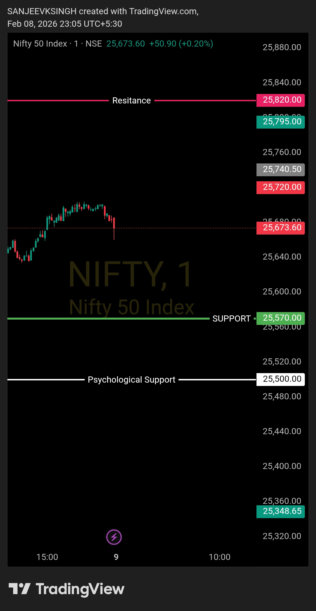

# Morning Plan — 09 Feb 2026

| **Market** | NIFTY50 |
|------------|---------|
| **Framework** | Opening Control Framework |
| **Opening Zone** | 25570 – 25820 |

**That's the only focus.**  
Everything else is commentary.  
Levels decide. Noise doesn't.

---

## Bias
**Bullish**

## Trade Direction
**Buy side only**

If NIFTY50 opens anywhere inside this zone, there is no guessing.  
Market intent is defined by acceptance within the opening range.

---

## Execution Logic

- **Opening between 25570 & 25820** → bullish control intact
- **Opening below 25570** → wait 4-5 minutes, observe price action:
  - Price must NOT sustain below support
  - Must reclaim and hold above the predefined zone (25570)
  - Bull plan executes only with a strong bull-supporting candle confirmation
- No counter-trend trades
- No anticipation, only reaction

---

## Acceptance Rule

As long as price accepts **above 25570**,  
the buy-side framework remains valid.

**If opening below 25570:**  
Monitor for 4-5 minutes — price should reject the breakdown, move back above support, and sustain with bullish confirmation before entering buy-side trades.

---

## Trade Management

- Pullbacks are buy opportunities
- No top calling
- No emotional execution

---

## Context

This is a **continuation plan** — intent is to support higher price acceptance.

Buyers are in control as long as 25570 holds.  
Pullbacks are **re-entry opportunities**, not breakdown fears.

---

## Core Principle

- **Levels decide**
- **Bias follows levels**
- **Everything else is noise**

---

## Chart / Image

---

## Video Reference

[Watch Morning Plan Video](./2026-02-09-nifty50-morning-plan.mp4) 

---

## Disclaimer

This post is not shared in real time.  
As per SEBI guidelines, live market data or real-time trade updates are not posted.  
Observations are shared with a time delay during market hours, strictly for educational and journal documentation purposes.
