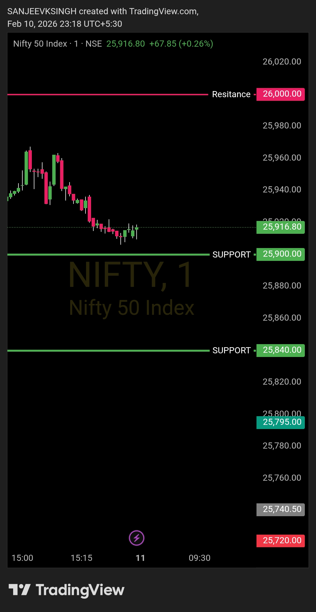

# Morning Plan — 11 Feb 2026

| **Market** | NIFTY50 |
|------------|---------|
| **Framework** | Opening Control Framework |
| **Opening Zone** | 25900 – 26000 |

**That's the only focus.**  
Everything else is commentary.  
Levels decide. Noise doesn't.

---

## Bias
**Bearish**

## Trade Direction
**Sell side only**

If NIFTY50 opens anywhere inside this zone, there is no guessing.  
Market intent is defined by acceptance within the opening range.

---

## Execution Logic

- **Opening between 25900 & 26000** → bearish control intact
- **Opening above 26000** → wait 4-5 minutes, observe price action:
  - Price must NOT sustain above resistance
  - Must break and hold below the predefined zone (26000)
  - Bear plan executes only with a strong bear-supporting candle confirmation
- No counter-trend trades
- No anticipation, only reaction

---

## Acceptance Rule

As long as price accepts **below 26000**,  
the sell-side framework remains valid.

**If opening above 26000:**  
Monitor for 4-5 minutes — price should reject the breakout, move back below resistance, and sustain with bearish confirmation before entering sell-side trades.

---

## Trade Management

- Rallies are sell opportunities
- No bottom calling
- No emotional execution

---

## Core Principle

- **Levels decide**
- **Bias follows levels**
- **Everything else is noise**

---

## Chart / Image

---

## Video Reference

[Watch Morning Plan Video](./2026-02-11-nifty50-morning-plan.mp4) 

---

## Disclaimer

This post is not shared in real time.  
As per SEBI guidelines, live market data or real-time trade updates are not posted.  
Observations are shared with a time delay during market hours, strictly for educational and journal documentation purposes.
