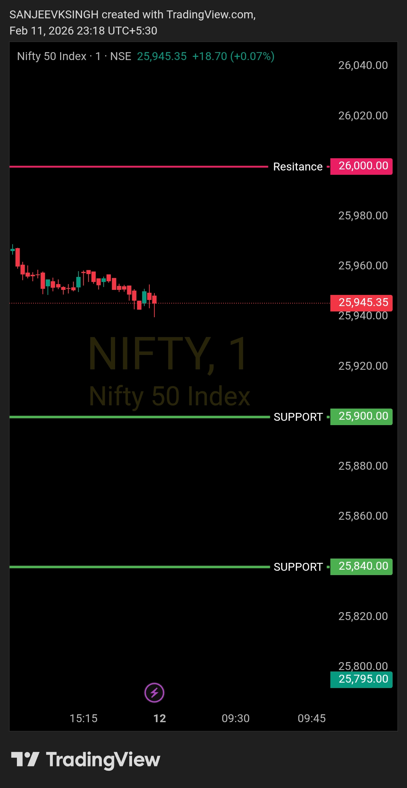

# Morning Plan — 12 Feb 2026

| **Market** | NIFTY50 |
|------------|---------|
| **Framework** | Opening Control Framework |
| **Opening Zone** | 25900 – 26000 |

**That's the only focus.**  
Everything else is commentary.  
Levels decide. Noise doesn't.

---

## Bias
**Bullish**

## Trade Direction
**Buy side only**

If NIFTY50 opens anywhere inside this zone, there is no guessing.  
Market intent is defined by acceptance within the opening range.

---

## Execution Logic

- **Opening between 25900 & 26000** → bullish control intact
- **Opening below 25900** → wait 4-5 minutes, observe price action:
  - Price must NOT sustain below support
  - Must reclaim and hold above the predefined zone (25900)
  - Bull plan executes only with a strong bull-supporting candle confirmation
- No counter-trend trades
- No anticipation, only reaction

---

## Acceptance Rule

As long as price accepts **above 25900**,  
the buy-side framework remains valid.

**If opening below 25900:**  
Monitor for 4-5 minutes — price should reject the breakdown, move back above support, and sustain with bullish confirmation before entering buy-side trades.

---

## Opening Preference

**Ideal opening:** Flat to gap-up inside the zone.  
A flat or gap-up opening keeps risk controlled and confirms bullish intent from the start.

**If market opens flat (near yesterday's close):** Risk increases. Price is more likely to test lower levels before finding direction. Caution required — wait for stronger confirmation before entering.

**If market opens gap-down below 25900:** Framework is under stress. Higher risk, lower conviction. Only enter if price strongly reclaims zone with clear bullish structure.

---

## Trade Management

- Pullbacks are buy opportunities
- No top calling
- No emotional execution

---

## Core Principle

- **Levels decide**
- **Bias follows levels**
- **Everything else is noise**

---

## Chart / Image

---

## Video Reference

[Watch Morning Plan Video](./2026-02-12-nifty50-morning-plan.mp4) 

---

## Disclaimer

This post is not shared in real time.  
As per SEBI guidelines, live market data or real-time trade updates are not posted.  
Observations are shared with a time delay during market hours, strictly for educational and journal documentation purposes.
