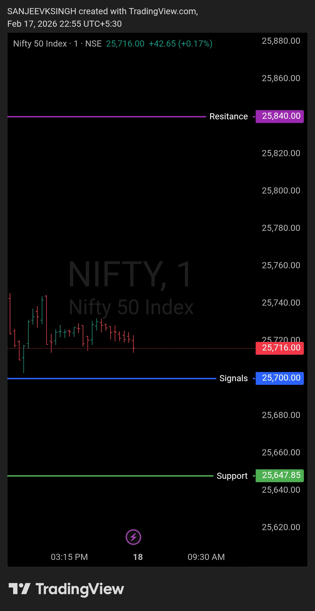

# Morning Plan — 18 Feb 2026

| **Market** | NIFTY50 |
|------------|---------|
| **Framework** | Opening Control Framework |
| **Opening Zone** | 25700 – 25840 |

**Levels decide.**

---

## Bias
**Bullish**

## Trade Direction
**Buy side only** (except major gap-down)

---

## Execution Logic
*(Gap-up/gap-down from previous day's close — 25,716)*

- **Opening between 25700 & 25840** → execute buy-side trades
- **Opening below 25700** (minor gap-down) → wait 4-5 minutes:
  - Price must reject and bounce back above 25700
  - Enter only with strong bullish candle confirmation
- **Major gap-down (below 25700)** → **no trade**

**Trade Management:** Pullbacks inside the zone are buy opportunities

---

## Bonus Trade: Gap-Up Bearish Scalp

**Setup:** Gap-up opening (above previous day's close — 25,716)
**Reason:** Profit booking / correction
**Exit:** Quick scalp — tight stop above gap-up high

---

## Chart / Image

---

## Video Reference

[Watch Morning Plan Video](./2026-02-18-nifty50-morning-plan.mp4)

---

## Disclaimer

Not shared in real time. Posted with time delay as per SEBI guidelines for educational purposes only.
