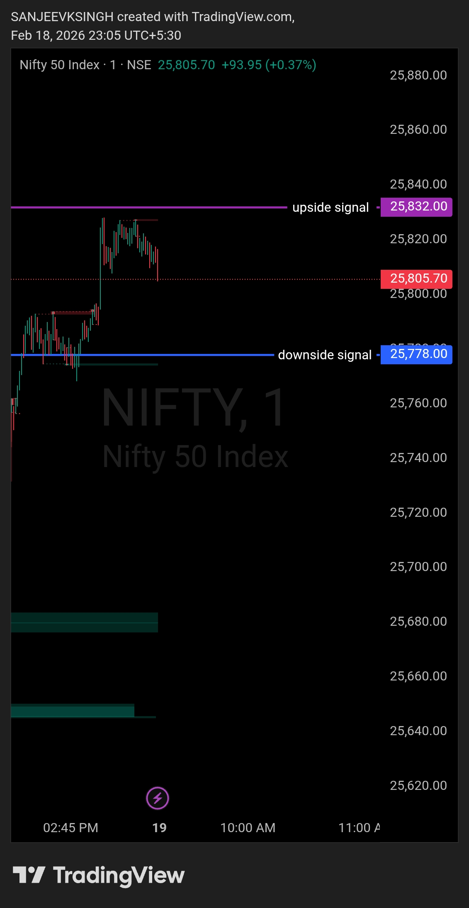

# Morning Plan — 19 Feb 2026

| **Market** | NIFTY50 |
|------------|---------|
| **Framework** | Neutral Zone Framework |
| **Key Levels** | 25832 (Bullish Trigger) / 25778 (Bearish Trigger) |

**That's the only focus.**  
Everything else is commentary.  
Levels decide. Noise doesn't.

---

## Bias
**Neutral — Level Dependent**

## Trade Direction
**Conditional**

- **Above 25832** → Bullish (Buy side only)
- **Below 25778** → Bearish (Sell side only)
- **Between 25778 – 25832** → NO TRADE ZONE

Market intent is defined by acceptance and sustained movement beyond the key levels.

---

## Execution Logic

### Bullish Scenario (Above 25832)
- **Opening above 25832** → Wait 5-15 minutes:
  - Price must SUSTAIN above 25832
  - No immediate rejection or breakdown below the level
  - Bullish structure confirmed → Buy-side trades only
  
### Bearish Scenario (Below 25778)
- **Opening below 25778** → Wait 5-15 minutes:
  - Price must SUSTAIN below 25778
  - No immediate bounce or reclaim above the level
  - Bearish structure confirmed → Sell-side trades only

### No Trade Zone (25778 – 25832)
- **Opening between 25778 and 25832** → WAIT
  - No trades until price decisively breaks and sustains beyond either level
  - This is a consolidation / neutral zone — no directional conviction
  - Observe first 5-15 minutes for breakout direction

---

## Acceptance Rule

**For Bullish Bias:**  
Price must open AND sustain above **25832** for the first 5-15 minutes.  
Only then, buy-side framework becomes active.

**For Bearish Bias:**  
Price must open AND sustain below **25778** for the first 5-15 minutes.  
Only then, sell-side framework becomes active.

**If price whipsaws between levels:**  
Sit out. No forced trades. Wait for clean, sustained direction.

---

## Opening Preference

**Ideal opening:**  
- **Above 25832 with momentum** → Bullish plan activates immediately
- **Below 25778 with momentum** → Bearish plan activates immediately

**Risky opening:**  
- **Inside the zone (25778–25832)** → No conviction, wait for breakout
- **At the exact levels (25832 or 25778)** → High risk of fakeout, wait for sustained move

**Worst case:**  
- **Whipsaw price action** across both levels in first 15 minutes → No trade day, step aside

---

## Trade Management

### If Bullish (Above 25832)
- Dips towards 25832 are buy opportunities
- No shorting
- No top calling

### If Bearish (Below 25778)
- Bounces towards 25778 are sell opportunities
- No buying
- No bottom calling

### If Neutral (Inside Zone)
- No trades
- No emotional execution
- Patience wins

---

## Core Principle

- **Levels decide**
- **Bias follows levels**
- **No conviction = No trade**
- **Everything else is noise**

---

## Chart / Image

---

## Video Reference

[Watch Morning Plan Video](./2026-02-19-nifty50-morning-plan.mp4)

---

## Disclaimer

This post is not shared in real time.  
As per SEBI guidelines, live market data or real-time trade updates are not posted.  
Observations are shared with a time delay during market hours, strictly for educational and journal documentation purposes.
