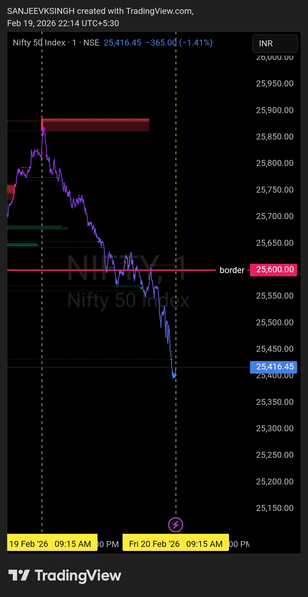

# Morning Plan — 20 Feb 2026

| **Market** | NIFTY50 |
|------------|---------|
| **Framework** | Bearish Control Framework |
| **Key Resistance** | 25600 |

**That's the only focus.**  
Everything else is commentary.  
Levels decide. Noise doesn't.

---

## Bias
**Bearish**

## Trade Direction
**Sell side only — unless major gap-up**

Default bias is bearish. The plan remains bearish unless market opens with a major gap-up above the resistance level of 25600.

---

## Execution Logic

### Bearish Plan (Default)
- **Opening below or near 25600** → Bearish bias intact
- Sell-side trades only
- Wait for confirmation in the first 5-15 minutes
- No counter-trend trades

### Exception — Major Gap-Up Above 25600
- **Opening significantly above 25600** → Framework invalidated
- Wait 5-15 minutes to observe:
  - Can price sustain above 25600?
  - Is this a genuine breakout or a fakeout?
- If sustenance fails, bearish plan may still execute
- If sustenance holds, step aside or reassess for bullish setup

---

## Acceptance Rule

**For Bearish Framework:**  
As long as price remains **below 25600**, the sell-side framework is valid.

**If major gap-up occurs:**  
- Opening above 25600 creates uncertainty
- Monitor first 5-15 minutes for price behaviour
- Framework shifts from "bearish default" to "wait and observe"
- Only resume bearish trades if price rejects and falls back below 25600

---

## Opening Preference

**Ideal opening:**  
Flat to gap-down below 25600. This keeps the bearish framework clean and risk controlled from the start.

**Acceptable opening:**  
Opening near or slightly below 25600 with bearish momentum. Wait for confirmation before entering trades.

**Risky opening:**  
Small gap-up (still below 25600) — higher risk of whipsaw. Caution required, wait for stronger confirmation.

**Framework stress:**  
Major gap-up above 25600 — bearish plan no longer applicable. Do not force bearish trades. Wait, observe, and reassess.

---

## Trade Management

- Pullbacks / bounces are sell opportunities (if below 25600)
- No bottom calling
- No emotional execution
- If price breaks and sustains above 25600, step aside

---

## Core Principle

- **Levels decide**
- **Bias follows levels**
- **Major gap-up = Plan invalidated**
- **Everything else is noise**

---

## Chart / Image

---

## Video Reference

[Watch Morning Plan Video](./2026-02-20-nifty50-morning-plan.mp4)

---

## Disclaimer

This post is not shared in real time.  
As per SEBI guidelines, live market data or real-time trade updates are not posted.  
Observations are shared with a time delay during market hours, strictly for educational and journal documentation purposes.
