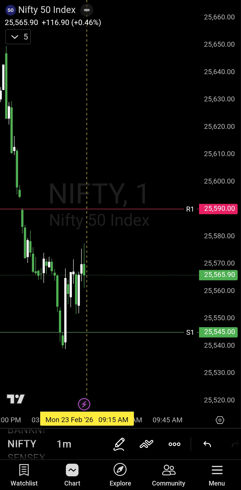

# Morning Plan — 23 Feb 2026

| **Market** | NIFTY50 |
|------------|---------|
| **Framework** | Opening Control Framework |
| **Bullish Zone** | 25590 and above |
| **Bearish Zone** | Below 25545 |
| **No Trade Zone** | 25545 – 25590 |

---

## The Setup

Opening above **25590**? Buyers are in control.  
Opening below **25545**? Sellers are in control.  
Opening between the two? Step aside.

This isn't complicated. The levels tell you who's running the show. Your job is to listen.

---

## Execution Plan

### If Opening Above 25590 (Bullish)
- Wait 5-15 minutes. Price needs to hold above 25590.
- If it does, buyers have the edge. Trade the buy side only.
- Pullbacks to 25590 are opportunities, not threats.
- No shorting. No top calling.

### If Opening Below 25545 (Bearish)
- Wait 5-15 minutes. Price needs to stay below 25545.
- If it does, sellers have the edge. Trade the sell side only.
- Bounces to 25545 are opportunities, not reversals.
- No buying. No bottom fishing.

### If Opening Between 25545 – 25590 (No Trade Zone)
- Sit tight. This is indecision territory.
- No trades until price breaks out and sustains beyond one of the levels.
- Don't guess direction. Wait for confirmation.

---

## The Logic

This is a continuation framework. The intent is to pressure the market in the direction of whoever's in control.

If buyers take charge, the plan is to stay on the buy side and ride the momentum.  
If sellers take charge, the plan is to stay on the sell side and ride the pressure.

Pullbacks aren't scary. They're reload zones. As long as the opening zone holds, the bias stays intact.

---

## Rules

- **Wait 5-15 minutes** after opening to confirm sustenance.
- **No anticipation.** Only react to what price is doing, not what you think it should do.
- **No emotional trades.** If you're not getting a clean setup, don't force one.
- **Pullbacks = opportunities.** They're not reversals unless the opening zone breaks.

---

## The Core Idea

Levels decide who's in control.  
Bias follows levels.  
Everything else is noise.

If you're not seeing a clear setup, there's no shame in sitting out. Patience is part of the edge.

---

## Chart Reference

---

## Video Breakdown

[Watch Morning Plan Video](./2026-02-23-nifty50-morning-plan.mp4)

---

## Disclaimer

This analysis is shared with a time delay as per SEBI guidelines.  
Not investment advice. For educational and journaling purposes only.

---

**— Sanjeev Singh**
