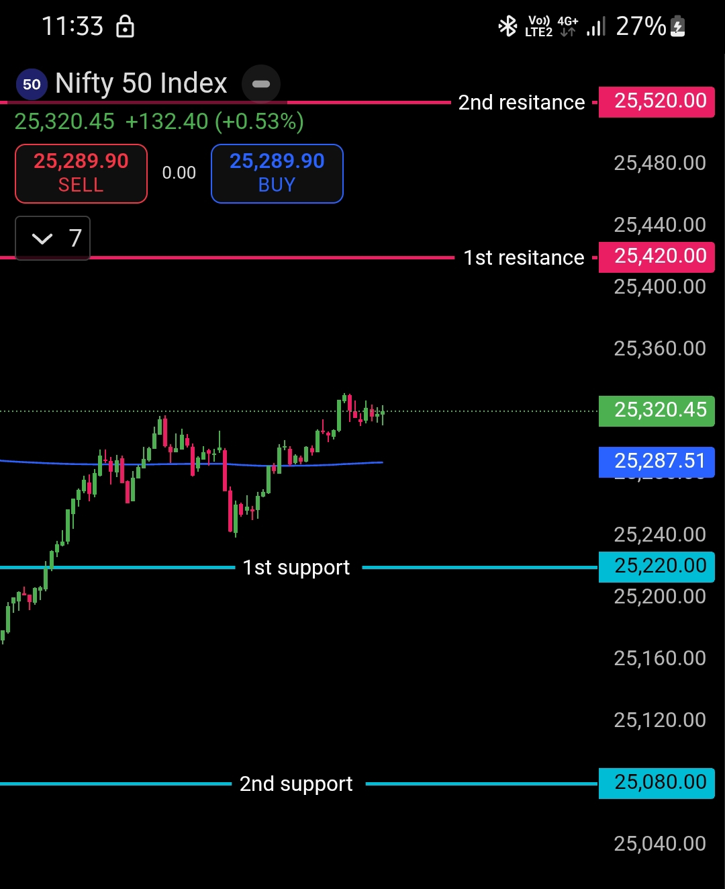

# Morning Plan | 23 Jan 2026

## NIFTY50 – Opening Control Framework

**First Support / Boundary:** 25220

- Below **25220** → Bears are in control
- Above **25220** → Bulls take control

---

### Execution Rule

The market should not open below the support/boundary.

If it opens below **25220**, then within the first **5-10 minutes**, price should recover above it.

That's the only thing worth watching.

Nothing else really matters.

---

### Core Principle

Levels decide.

Noise doesn't.

---

### Chart Analysis

