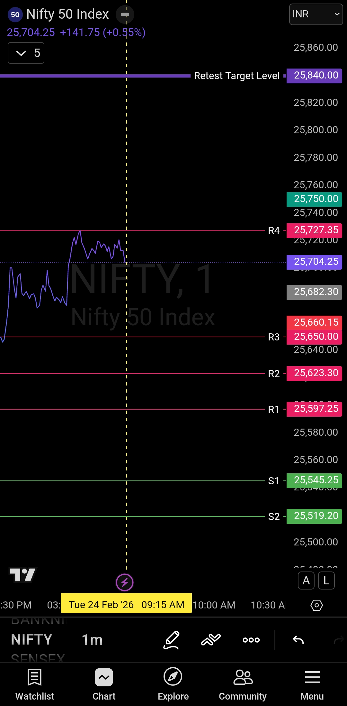

# Morning Plan — 24 Feb 2026

| **Market** | NIFTY50 |
|------------|---------|
| **Framework** | Retest & Acceptance Framework |
| **Key Level** | 25840 |
| **Bias** | Cautious Bullish (Confirmation Required) |

---

## The Setup

Price is approaching **25840** — the same level where the market saw a sharp decline earlier. This is a retest zone.

When price comes back to levels like this, it's not about being bullish or bearish. It's about being careful. These zones attract volatility, stop hunts, and positioning traps.

The market might shake out weak hands before deciding on a sustained direction. Your job is to not be one of them.

---

## What 25840 Represents

This isn't just a number. It's a psychological and liquidity level.

- **Psychological:** Traders remember the decline from here. Fear and greed collide at this spot.
- **Liquidity:** Stop losses cluster around such levels. The market loves hunting them before moving.

Retests like this can go either way. The key is not to predict — it's to wait for confirmation.

---

## Execution Plan

### Before 25840 Acceptance
- **Reduce position sizing.** This is not the time for full conviction.
- **Control risk.** The market can fake you out in either direction.
- **No chasing.** If price is running toward 25840, don't jump in blindly.

### If Price Tests 25840 and Holds
- **Watch for acceptance.** Does price sustain above 25840 for 5-15 minutes?
- **Look for confirmation candles.** Full-bodied bullish bars with minimal rejection = strength.
- **If acceptance is clear:** Increase exposure. Buy-side trades become valid.

### If Price Rejects 25840
- **Step aside.** Rejection means the level is still acting as resistance.
- **Wait for the next setup.** Don't force trades just because you're watching.

---

## Trading Options

You have three structured choices here:

### Option 1: Wait for Confirmation Above 25840
- Stay light or sit out until price shows sustained acceptance above 25840.
- Once confirmed, participate on the buy side with conviction.
- This is the safest approach if you want clarity before committing capital.

### Option 2: Buy on Pullbacks (Not Breakouts)
- If price is approaching 25840, wait for a pullback.
- Enter on dips, not on momentum spikes.
- This keeps your entry cleaner and your risk tighter.

### Option 3: Scalp Pullbacks While Waiting
- Trade small pullbacks in either direction while the market decides.
- Keep size small. Keep targets realistic.
- This is for traders who want to stay active but don't want directional exposure yet.

---

## What to Avoid

- **Don't anticipate acceptance.** Wait for it to happen.
- **Don't chase breakouts toward 25840.** Let price come to you.
- **Don't go all-in before confirmation.** This is a trap-prone zone.
- **Don't ignore rejection.** If 25840 holds as resistance, respect it.

---

## The Core Idea

This is a retest. Retests are not signals — they're tests.

The market will decide if 25840 becomes support or if it stays resistance. Your job is to react to that decision, not predict it.

**Focus on reaction, not anticipation.**  
Let price confirm acceptance before increasing exposure.

---

## Rules

- **Reduced position sizing** until 25840 is cleared and held.
- **Buy pullbacks, not breakouts.**
- **Confirmation comes from sustained acceptance** — not a single candle.
- **If in doubt, step aside.** No trade is better than a forced trade.

---

## Chart Reference

---

## Video Breakdown

[Watch Morning Plan Video](./2026-02-24-nifty50-morning-plan.mp4)

---

## Disclaimer

This content is shared for educational purposes only. Live market data is not posted in real time. Not investment advice.

---

**— Sanjeev Singh**
