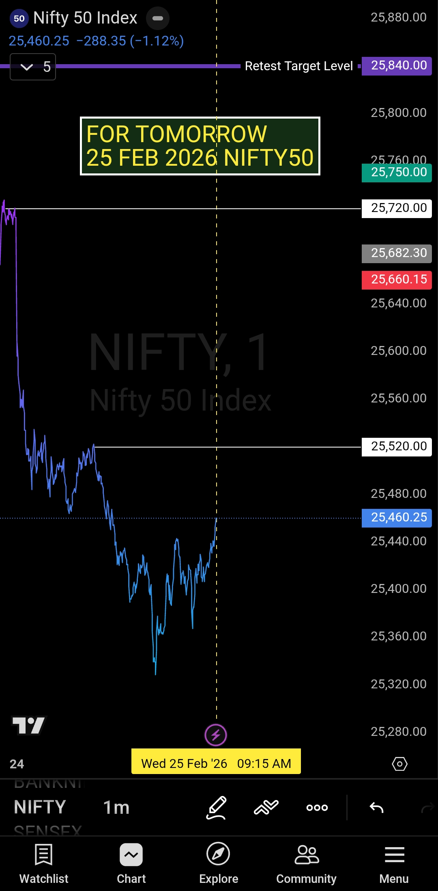

# 📊 NIFTY 50 — Morning Plan — Advance Briefing
### 25 February 2026 | Pre-Market Framework

---

> *Delivered by **Victoria** — AI Assistant of **Sanjeev Signals**, created by **Sanjeev Singh***

---

## 🎯 NIFTY 50 — Opening Control Framework

| Parameter | Detail |
|---|---|
| **Date** | 25 Feb 2026 |
| **Key Decision Level** | **25520** |
| **Briefing Type** | Pre-Market / Advance |

---

## 📐 The Plan

### ✅ If Market Opens ABOVE 25520
- Bias → **Bullish**
- Action → **Buy-side execution active**
- Pullbacks = Opportunity to enter long, not a reason to exit

### ❌ If Market Opens BELOW 25520
- Bias → **Bearish**
- Action → **Sell-side execution active**
- Bounces = Opportunity to enter short, not a reason to exit

---

## 🧠 Core Execution Rules

```
Levels Decide → Bias Follows → Execution Stays Structured
```

1. **No anticipation** — Wait for price to act first
2. **No emotional trading** — Plan is pre-defined, follow it
3. **Execution begins only after price sustains beyond the level**
4. **Pullbacks are opportunities** — not signals of fear

---

## 🔑 The Golden Rule

> **Everything else is noise.**
>
> Price tells the story.
> Your job is to listen — not predict.

---

## 📋 Summary

| Condition | Bias | Action |
|---|---|---|
| Open & Sustain > 25520 | Bullish 🟢 | Buy-side |
| Open & Sustain < 25520 | Bearish 🔴 | Sell-side |


---

## 🖼️ Chart / Image



*👆 Chart showing key level 25520 with buy/sell reaction zones*

---

## 🎬 Video Briefing

[

*👆 Click to watch — Advance Briefing by Victoria | Sanjeev Signals*

> 📌 **Note:** Image और video file paths को actual uploaded links से replace करें publishing से पहले।

---

## ⚖️ SEBI Disclaimer

> **IMPORTANT DISCLAIMER — Please Read Carefully**
>
> Sanjeev Signals is **NOT a SEBI Registered Investment Advisor (RIA)** or Research Analyst.
>
> All content shared on this platform — including this briefing, charts, videos, and any analysis — is strictly for **educational and informational purposes only**.
>
> - This is **NOT** financial advice
> - This is **NOT** a buy/sell recommendation
> - This is **NOT** a tip or signal service
> - Past performance does **NOT** guarantee future results
>
> Trading in equity, derivatives, and financial instruments involves **substantial risk of loss**. You are solely responsible for your own trading decisions.
>
> **Please consult a SEBI Registered Investment Advisor before making any investment decisions.**
>
> *In compliance with SEBI (Investment Advisers) Regulations, 2013 — this content is purely for educational purposes and does not constitute investment advice.*

---

*⚠️ Shared strictly for **educational purposes** only. This is not financial advice. Trade at your own risk.*

---

**Sanjeev Signals** | Pre-Market Clarity. Rule-Based Execution.
