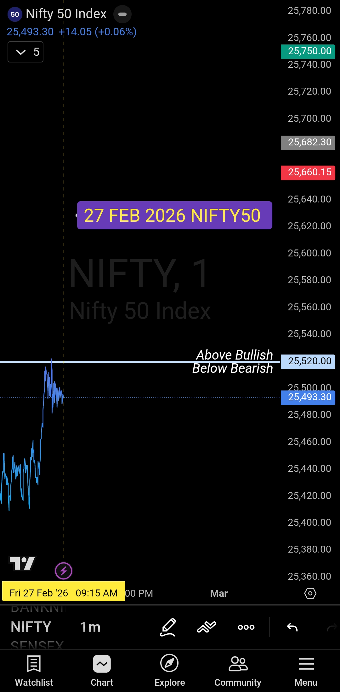

# NIFTY 50 — Advance Briefing
### Friday, 27 February 2026 | Pre-Market Framework

**Sanjeev Signals** — *Delivered by Victoria, AI Assistant | Created by Sanjeev Singh*

---

## Today's Decision Level

> # 25,520
> **NIFTY 50 Key Level — 27 February 2026**

One level. One plan. No guesswork.

---

## Opening Control Framework

| | |
|---|---|
| **Date** | Friday, 27 February 2026 |
| **Instrument** | NIFTY 50 |
| **Key Decision Level** | 25,520 |
| **Briefing Type** | Pre-Market — Advance |
| **Series** | Daily Morning Briefing |

---

## The Plan

The framework is binary. Price either sustains above the level or it does not. Bias follows price — not the other way around.

**Above 25,520 — Bullish Bias**
Market opens and sustains above 25,520. Bias turns bullish. Focus shifts entirely to buy-side execution. Pullbacks within the upward move are entry opportunities — not exit signals.

**Below 25,520 — Bearish Bias**
Market opens and sustains below 25,520. Bias remains bearish. Focus shifts entirely to sell-side execution. Bounces within the downward move are entry opportunities — not exit signals.

---

## Core Principles

```
Levels Decide  →  Bias Follows  →  Execution Stays Structured
```

- Wait for price to act. Never anticipate.
- The plan is pre-defined. Trust it and execute.
- Enter only after price sustains beyond the level — not before.
- Pullbacks are part of the move. Stay with the bias.

> *Everything else is noise.*
> *Price tells the story. Your job is to listen — not predict.*

---

## Post-Trade Journal

### NIFTY 50 | 1-Minute Chart | 27 February 2026

*This section will be updated after market close with today's trade details, execution review, and outcome.*

---

## Chart


*NIFTY 50 — 1-Min Chart | 27 Feb 2026 | Key Decision Level: 25,520*

---

## Video Briefing

[▶ Watch Today's Advance Briefing — Victoria | Sanjeev Signals](./2026-02-27-nifty50-morning-plan.mp4)

---

## Legal Disclaimer

Sanjeev Signals is **not** a SEBI Registered Investment Advisor (RIA) or Research Analyst. All content published on this platform — including daily briefings, charts, trade journals, and videos — is strictly for **educational and informational purposes only**.

Nothing published here constitutes financial advice, investment advice, a buy or sell recommendation, or a tip service of any nature. Trading in equities, derivatives, and financial instruments carries substantial risk of capital loss. Past performance is not indicative of future results. You are solely and entirely responsible for your own trading and investment decisions.

Before making any financial decision, please consult a SEBI Registered Investment Advisor.

*Published in compliance with SEBI (Investment Advisers) Regulations, 2013.*

---

**Sanjeev Signals**
Pre-Market Clarity. Rule-Based Execution.
*#NiftyAnalysis #PreMarketBriefing #SanjeevSignals #RuleBasedTrading*
