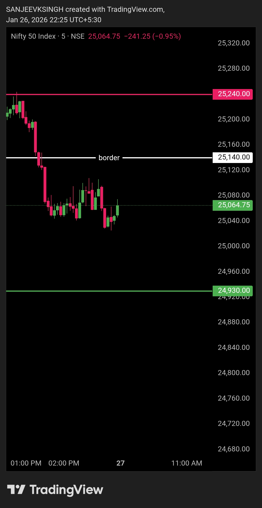

# Morning Plan — 28 Jan 2026

## Instrument
NIFTY50

## Market Focus
Opening Control Read

## Context
Pre-market plan is built around **25420 boundary** (first resistance).

- Below 25420 → Bears are in control  
- Above 25420 → Bulls take control  

This level will define opening control and directional authority.

## What Matters
- If the market opens **above 25420**, observe the first **5 minutes**
- Sustained acceptance above the level → **Bullish control**
- Failure to hold above the level → **No long bias**

## Execution Bias
- Trade only after **clear control confirmation**
- No anticipation, no emotional trades
- Let the level decide

## Notes
- Everything else is noise  
- Levels decide, nothing else  
- No debate, no second chances  

---

## Image / Chart

