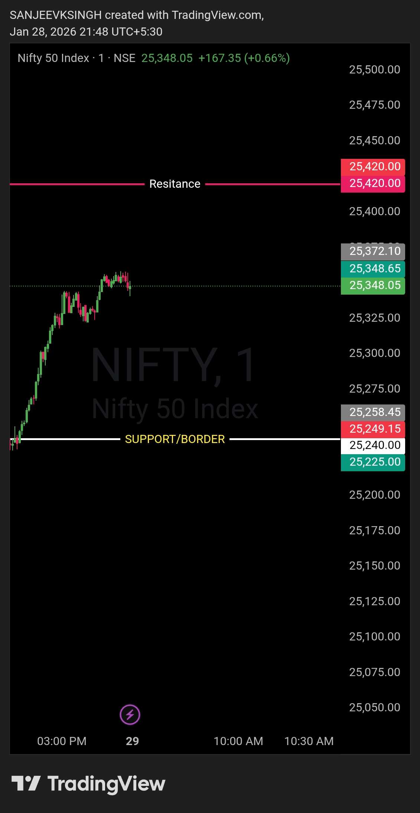

# Morning Plan — 29 Jan 2026

## Instrument
NIFTY50

## Market Focus
Opening Control Framework

## Context
Pre-market plan is built around **25240 boundary** (first support).

- Below 25240 → Bears are in control  
- Above 25240 → Bulls take control  

This level will define opening control and directional authority.

## What Matters
- Market **should not open below 25240**
- If it opens below **25240**, observe the first **3–4 minutes**
- Price should **not sustain below the boundary**
- Sustained acceptance below the level → **Bearish control**
- Failure to sustain below the level → **Reclaim in favor of bulls**

## Execution Bias
- Trade only after **clear control confirmation**
- No anticipation, no emotional positioning
- Let price acceptance decide

## Notes
- This is the only thing worth watching  
- Everything else is noise  
- Levels decide, noise doesn’t  

---

## Image / Chart

