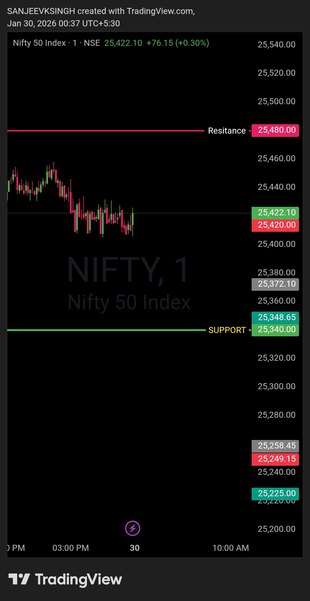

# Morning Plan — 30 Jan 2026

NIFTY50 | Opening Control Framework

**Opening Zone (Bull Bias): 25340 – 25480**

- Opening between 25340 & 25480 → **Bulls in control**  
- Trade direction → **Bull side only**

If NIFTY50 opens anywhere inside this zone, there is **no guessing**.  
Trades are executed strictly **on the bull side**.

No need to predict tops. No need to overthink structure.  
This range itself defines market intent.

As long as price respects the zone, **bulls have the edge**.

**That’s the only focus.**  
Everything else is commentary.  
**Levels decide. Noise doesn’t.**

---

## Chart / Image

## Video Reference
<video width="600" controls>
  <source src="./2026-01-30-nifty50-pre.mp4" type="video/mp4">
  Your browser does not support the video tag.
</video>

---

## Disclaimer
This post is **not shared in real time**.  
As per **SEBI guidelines**, live market data or real-time trade updates are not posted.  
Observations are shared with a **time delay during market hours**, strictly for **educational and journal documentation purposes**.
