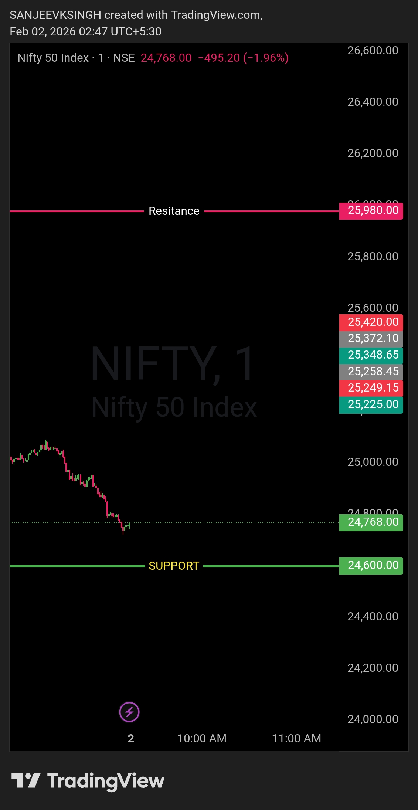

# Morning Plan — 2 Feb 2026

NIFTY50 | Opening Control Framework

**Opening Zone (Bear Bias): 24600 – 24980**

- Opening between 24600 & 24980 → **Bears in control**  
- Trade direction → **Sell side only**

If NIFTY50 opens anywhere inside this zone, there is **no guessing**.  
Trades are executed strictly **on the sell side**.

No need to hunt bottoms. No need to anticipate reversals.  
This range itself defines market intent.

As long as price accepts below **24980**, **bears have the edge**.

**That’s the only focus.**  
Pullbacks are opportunities, not traps.  
**Levels decide. Noise doesn’t.**

---

## Chart / Image

## Video Reference
<video width="600" controls>
  <source src="./2026-02-02-nifty50-pre.mp4" type="video/mp4">
  Your browser does not support the video tag.
</video>

---

## Disclaimer
This post is **not shared in real time**.  
As per **SEBI guidelines**, live market data or real-time trade updates are not posted.  
Observations are shared with a **time delay during market hours**, strictly for **educational and journal documentation purposes**.
